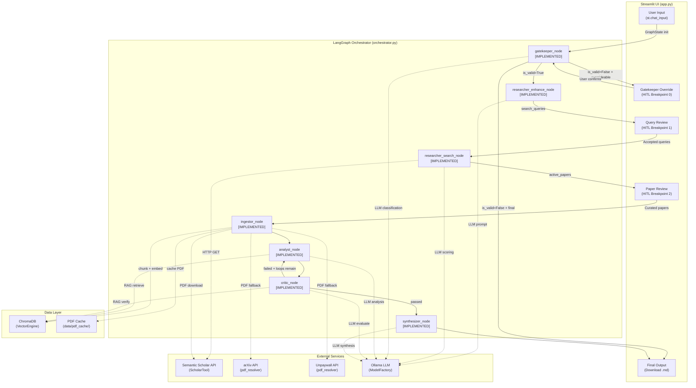
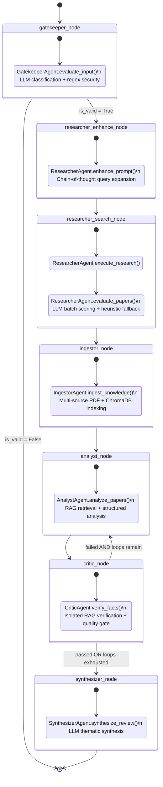
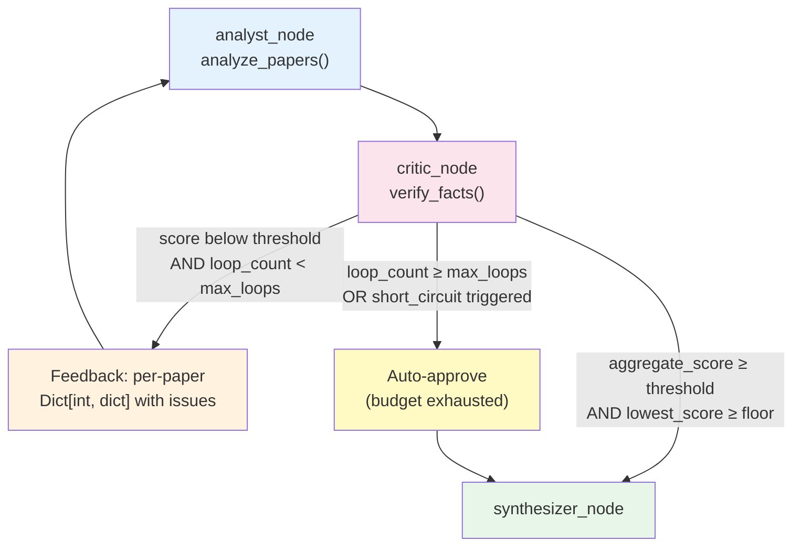
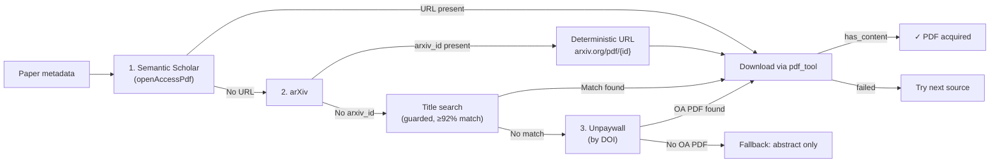
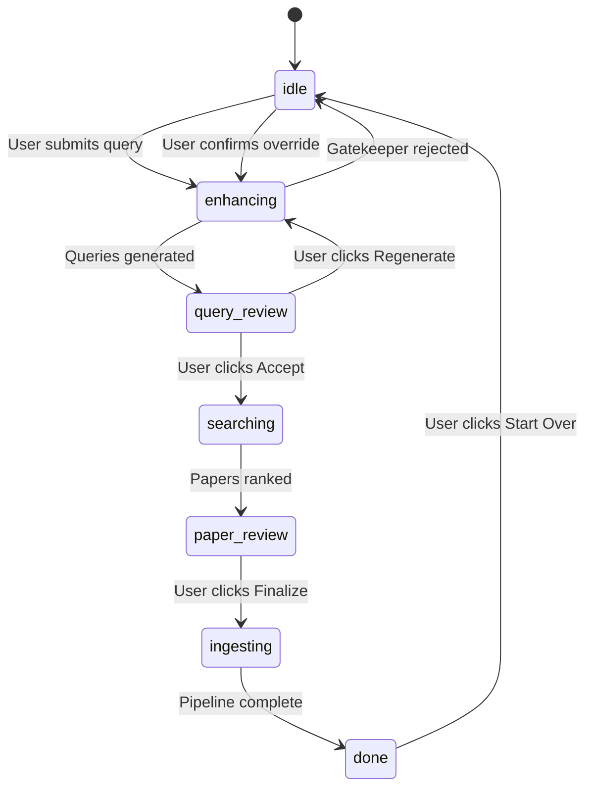
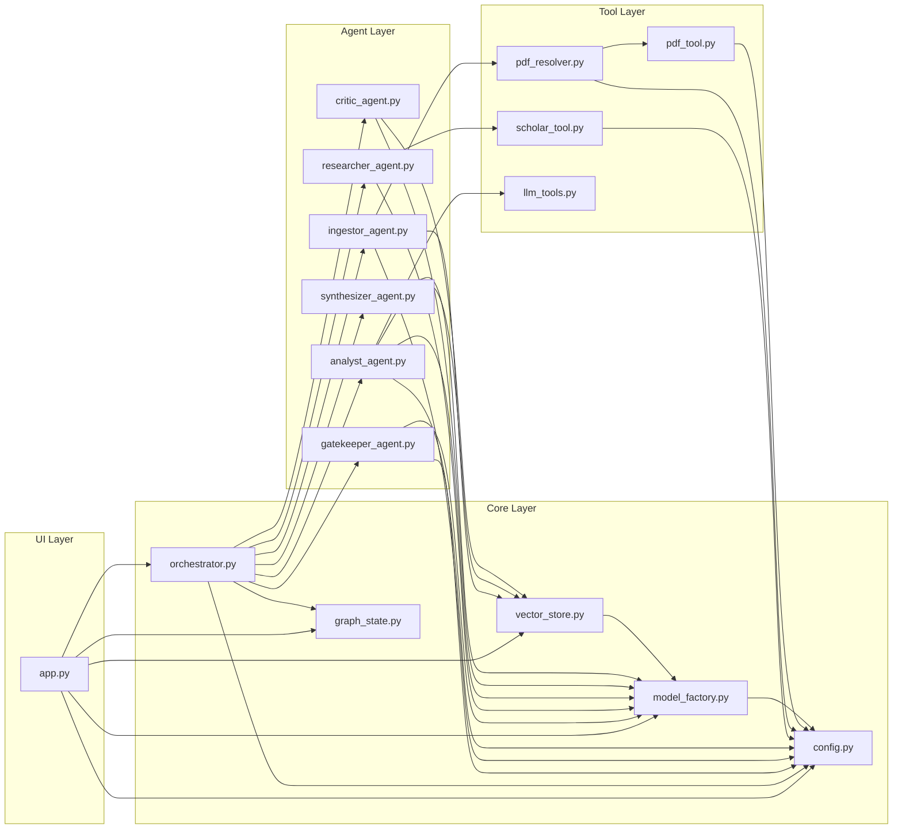

# SmartScholar — Internal Architecture Reference

> **Document Class:** Internal · Deep-Dive · Authoritative  
> **Last Updated:** 2026-07-15  
> **Scope:** Complete system architecture for the SmartScholar Agentic RAG pipeline.
---

## Table of Contents

1. [Executive Architecture Overview](#1-executive-architecture-overview)
2. [Core Infrastructure Components (Deep Dive)](#2-core-infrastructure-components-deep-dive)
3. [The Multi-Agent System (Function-by-Function Breakdown)](#3-the-multi-agent-system)
4. [The Tool Layer](#4-the-tool-layer)
5. [The 16-Step Execution Flow](#5-the-16-step-execution-flow)
6. [UI & Observability (`app.py`)](#6-ui--observability-apppy)
7. [Appendix — Dependency Map](#7-appendix--dependency-map)
8. [Current Limitations & Future Work](#8-current-limitations--future-work)

---

## 1. Executive Architecture Overview

### 1.1 Core Paradigm

SmartScholar implements an **Agentic RAG (Retrieval-Augmented Generation)** pipeline that automates scientific literature search, curation, analysis, and synthesis. The architecture is defined by three interlocking design principles:

| Principle | Implementation |
|---|---|
| **State-Machine Orchestration** | A [LangGraph](https://github.com/langchain-ai/langgraph) `StateGraph` defines the directed-acyclic execution topology. Every agent is a pure function `(GraphState, RunnableConfig) → dict` that receives the shared state, performs work, and returns a *partial update*. |
| **Reactive UI with HITL Breakpoints** | A [Streamlit](https://streamlit.io) application (`app.py`) drives a step-by-step workflow. Between major phases (query expansion → search → paper review → analysis), the pipeline **yields control to the user**, who can edit, accept, reject, or regenerate before the next graph segment fires. A Gatekeeper override confirmation provides an additional HITL breakpoint for borderline queries. |
| **Unidirectional Data Flow** | Data flows in one direction: User Input → `GraphState` → Agent Nodes → `GraphState` → UI Render. The UI *never* writes directly to agent internals; it mutates `st.session_state.graph_state` and then invokes the next graph segment. |

### 1.2 Single Source of Truth (SSOT) — `config.yaml`

All numeric limits, depth settings, loop budgets, LLM generation parameters, RAG tuning knobs, quality-gate thresholds, and system-level timeouts are centralised in a single YAML file at the project root. No magic numbers exist anywhere in the codebase — every node function resolves its limits at runtime via `_resolve_config(state)` → `get_config(profile)`.

#### 1.2.1 Profile Parameters

Three **research profiles** dictate system behaviour:

| Parameter | `fast` | `medium` | `pro` | Description |
|---|:---:|:---:|:---:|---|
| **`max_queries`** | 3 | 5 | 10 | Maximum number of expanded search queries the Researcher may generate. |
| **`top_n_papers`** | 3 | 5 | 10 | The cut-off point for the active vs. discarded paper split after scoring. |
| **`read_depth`** | `abstract` | `hybrid` | `full_pdf` | Depth of content ingestion (governs `IngestorAgent` behaviour). |
| **`full_text_top_n`** | — | 3 | — | Medium-only: how many of the top-ranked papers get full-text PDF ingestion. The remainder get abstract-only. |
| **`max_loops`** | 1 | 2 | 3 | Maximum Critic → Analyst feedback iterations before auto-approving. |

#### 1.2.2 RAG Configuration (`rag` sub-dict)

Each profile contains a nested `rag` configuration block controlling chunking and retrieval behaviour:

| Parameter | `fast` | `medium` | `pro` | Description |
|---|:---:|:---:|:---:|---|
| **`chunk_size`** | 1024 | 512 | 256 | Token-level chunk size for `SentenceSplitter` during ingestion. Smaller chunks yield finer-grained retrieval at the cost of more ChromaDB entries. |
| **`chunk_overlap`** | 100 | 50 | 30 | Overlap window between adjacent chunks (in tokens), preventing sentence-boundary information loss. |
| **`analyst_top_k`** | 3 | 5 | 8 | Number of ChromaDB chunks the Analyst retrieves per question during RAG-based analysis. |
| **`critic_top_k`** | 2 | 3 | 5 | Number of ChromaDB chunks the Critic retrieves per claim during RAG-based verification. |

#### 1.2.3 Quality Gate Configuration (`quality_gates` sub-dict)

| Parameter | `fast` | `medium` | `pro` | Description |
|---|:---:|:---:|:---:|---|
| **`critic_pass_threshold`** | 50 | 60 | 70 | Minimum **aggregate** consistency score (average across all papers) required for the Critic to approve a batch. |
| **`critic_min_floor_score`** | 35 | 45 | 50 | Minimum score for the **lowest-scoring individual paper**. Prevents a single hallucinated record from hiding behind a high batch average. |
| **`short_circuit_final_eval`** | `true` | `true` | `true` | When enabled, the Critic bypasses LLM verification on the final loop iteration (`loop_count >= max_loops - 1`) when no retry budget remains, instantly releasing records to the Synthesizer. |

#### 1.2.4 LLM Generation Parameters (`llm` sub-dict)

| Parameter | `fast` | `medium` | `pro` | Description |
|---|:---:|:---:|:---:|---|
| **`temperature_analytical`** | 0.1 | 0.1 | 0.1 | Used by Analyst, Critic, Ingestor, Gatekeeper — low temperature for deterministic, factual outputs. |
| **`temperature_creative`** | 0.3 | 0.4 | 0.4 | Used by Researcher (query expansion) and Synthesizer — slightly higher for diverse, creative outputs. |
| **`max_tokens_short`** | 500 | 800 | 1000 | Generation budget for short extractions: Gatekeeper classification, Analyst question generation. |
| **`max_tokens_long`** | 1000 | 1500 | 2000 | Generation budget for deep analysis: Analyst record generation, Critic evaluation, Synthesizer review. |

#### 1.2.5 System Configuration (`system` top-level section)

The `system` section sits outside the profile hierarchy and applies globally:

| Parameter | Value | Description |
|---|---|---|
| **`network.http_timeout_seconds`** | `10.0` | Connect/read timeout for external HTTP calls (Semantic Scholar, arXiv, Unpaywall). Used as `(val, val * 3.0)` tuple for connect/read in `pdf_resolver` and `pdf_tool`. |
| **`network.llm_timeout_seconds`** | `300.0` | Request timeout for Ollama LLM calls via `ModelFactory.get_model()`. |
| **`network.health_check_timeout_seconds`** | `2.0` | Timeout for the Ollama availability probe (`ModelFactory.check_availability()`). |
| **`network.max_retries`** | `3` | Maximum retry attempts for transient HTTP failures (PDF downloads, Semantic Scholar API). |
| **`ui.log_title_truncation`** | `60` | Character limit for paper titles in trace log messages. |
| **`ui.log_snippet_truncation`** | `120` | Character limit for analysis field snippets in trace log messages. |

### 1.3 High-Level Data-Flow Diagram



---

## 2. Core Infrastructure Components (Deep Dive)

### 2.1 `config.py` & `config.yaml`

**File:** [`config.py`](file:///c:/Users/olive/OneDrive/Desktop/Master%20Studium/KI/Praktikum/projekt/SmartScholar/src/core/config.py)  
**File:** [`config.yaml`](file:///c:/Users/olive/OneDrive/Desktop/Master%20Studium/KI/Praktikum/projekt/SmartScholar/config.yaml)

#### Mechanism

1. **Path Resolution:** `_PROJECT_ROOT` is computed by walking two levels up from `config.py`'s `__file__` path, yielding the SmartScholar project root. `_CONFIG_PATH` is then `os.path.join(_PROJECT_ROOT, "config.yaml")`.
2. **Load & Cache:** `_load_config()` reads and parses the YAML file exactly once via `@lru_cache(maxsize=1)`. Subsequent calls return the cached `dict` with zero disk I/O.
3. **Profile Access:** `get_config(profile_name: str)` performs a case-insensitive lookup into the `profiles` sub-dict. An unknown profile raises `ValueError` with a helpful message listing all valid profiles.
4. **Profile Enumeration:** `list_profiles()` returns `["fast", "medium", "pro"]` for UI rendering.
5. **System Config Access:** `get_system_config()` returns the `system` top-level dict, providing global network timeouts and UI truncation limits to any module that needs them.

#### API Surface

| Function | Signature | Returns | Notes |
|---|---|---|---|
| `_load_config()` | `() → dict` | Full parsed YAML | Cached; raises `FileNotFoundError` if `config.yaml` is missing. |
| `get_config()` | `(profile_name: str) → dict` | Profile sub-dict | Case-insensitive key matching via `.strip().lower()`. |
| `list_profiles()` | `() → list[str]` | `["fast", "medium", "pro"]` | Used by UI sidebar profile radio. |
| `get_system_config()` | `() → dict` | System sub-dict | Global settings: network timeouts, UI truncation limits. Called by `ModelFactory`, `ScholarTool`, `pdf_tool`, `pdf_resolver`, `AnalystAgent`, `IngestorAgent`. |

#### Hierarchical YAML Structure

```yaml
profiles:
  fast:                              # ⚡ Quick scan
    max_queries: 3
    top_n_papers: 3
    read_depth: abstract
    max_loops: 1
    rag:                             # Chunking & retrieval tuning
      chunk_size: 1024
      chunk_overlap: 100
      analyst_top_k: 3
      critic_top_k: 2
    quality_gates:                   # Critic pass/fail thresholds
      critic_pass_threshold: 50
      critic_min_floor_score: 35
      short_circuit_final_eval: true
    llm:                             # LLM generation budgets
      temperature_analytical: 0.1
      temperature_creative: 0.3
      max_tokens_short: 500
      max_tokens_long: 1000

  medium:                            # ⚖️ Balanced
    # (same structure, different values — see §1.2)
    full_text_top_n: 3               # ← medium-only

  pro:                               # 🔬 Exhaustive
    # (same structure, different values — see §1.2)

system:                              # Global (not profile-dependent)
  network:
    http_timeout_seconds: 10.0
    llm_timeout_seconds: 300.0
    health_check_timeout_seconds: 2.0
    max_retries: 3
  ui:
    log_title_truncation: 60
    log_snippet_truncation: 120
```

---

### 2.2 `graph_state.py`

**File:** [`graph_state.py`](file:///c:/Users/olive/OneDrive/Desktop/Master%20Studium/KI/Praktikum/projekt/SmartScholar/src/core/graph_state.py)

`GraphState` is a `TypedDict(total=False)` — every key is optional, allowing nodes to return partial updates. LangGraph merges these updates into the accumulating state dict automatically.

#### Complete Key Reference

| Key | Type | Set By | Description |
|---|---|---|---|
| **`user_query`** | `str` | UI (initial state) | The raw research topic entered by the user. |
| **`config_profile`** | `str` | UI (initial state) | One of `"fast"`, `"medium"`, `"pro"`. Used by `_resolve_config()` in every node. |
| **`is_valid`** | `bool` | `gatekeeper_node` | `True` if the query passed validation. |
| **`validation_reason`** | `str` | `gatekeeper_node` | Human-readable rejection reason (empty string on accept). |
| **`gatekeeper_needs_confirmation`** | `bool` | `gatekeeper_node` | `True` if the Gatekeeper rejected a safe but unclear request and the UI may offer a confirmation retry. |
| **`gatekeeper_confirmed`** | `bool` | `gatekeeper_node` / UI | `True` when the user explicitly confirmed an unclear request via the override flow. |
| **`gatekeeper_severity`** | `str` | `gatekeeper_node` | `"none"`, `"content_issue"`, or `"security_critical"`. Security-critical rejections can never be overridden. |
| **`gatekeeper_can_override`** | `bool` | `gatekeeper_node` | `True` only when the Gatekeeper rejection may be overridden by explicit user confirmation. Always `False` for security-critical rejections. |
| **`gatekeeper_follow_up_question`** | `str` | `gatekeeper_node` | Optional user-facing follow-up question for overrideable content issues (e.g., "Did you mean to research this as an academic topic?"). |
| **`gatekeeper_override_allowed`** | `bool` | UI | `True` only for a retry that was created from an overrideable prior Gatekeeper decision. The `gatekeeper_node` checks this flag in combination with `gatekeeper_confirmed` to auto-approve confirmed overrides. |
| **`search_queries`** | `list[str]` | `researcher_enhance_node` | Refined academic search terms produced by LLM query expansion. |
| **`query_strategy`** | `str` | `researcher_enhance_node` | Agent's internal monologue explaining why it chose specific search angles. |
| **`active_papers`** | `list[dict]` | `researcher_search_node` / `ingestor_node` | Papers selected for deep analysis (top-N by relevance score). Augmented by the Ingestor with `chunk_ids`, `ingestion_status`, `ingested_depth`, `pdf_reason`, `pdf_source`. |
| **`discarded_papers`** | `list[dict]` | `researcher_search_node` | Papers that scored below the active cut-off. Held in a reserve pool for HITL promotion. |
| **`vectorEngine`** | `VectorEngine` | `ingestor_node` | The live `VectorEngine` instance that owns the ChromaDB collection. Threaded through state so the Analyst and Critic can query the same collection. |
| **`paper_analysis_data`** | `list[dict]` | `analyst_node` | Structured analysis records (methodology, findings, limitations, relevance). |
| **`critic_feedback`** | `str` | `critic_node` | Textual feedback from the Critic agent. On failure, this is a `Dict[int, dict]` keyed by `citation_id` with per-paper verdicts. |
| **`loop_count`** | `int` | `critic_node` | Current Critic → Analyst iteration count. Starts at `0`, incremented by `critic_node` each pass. |
| **`_critic_passed`** | `bool` | `critic_node` | Internal routing flag. `True` means the analysis passed verification. Consumed by `_route_after_critic()`. |
| **`final_review`** | `str` | `synthesizer_node` | The Markdown-formatted literature review produced by the Synthesizer. |

> [!NOTE]
> **Undeclared transient key:** `_budget_exhausted` (`bool`) is set by `critic_node` when `not passed and current_loop >= max_loops`. It is **not** declared in the `GraphState` TypedDict but exists in the runtime state dict. This is an intentional pattern to keep internal routing metadata out of the formal schema.

---

### 2.3 `orchestrator.py`

**File:** [`orchestrator.py`](file:///c:/Users/olive/OneDrive/Desktop/Master%20Studium/KI/Praktikum/projekt/SmartScholar/src/core/orchestrator.py)

This is the **nerve centre** of the system. It registers all agent node functions, defines the graph topology, provides conditional routing, and exposes streaming wrappers for the UI.

#### 2.3.1 Agent Singletons

Six module-level variables (`_gatekeeper`, `_researcher`, `_ingestor`, `_analyst`, `_critic`, `_synthesizer`) hold lazily-initialised agent instances. Each has a corresponding `_get_<agent>()` factory that performs thread-safe lazy init on first access. Agents are **never** re-created across invocations within the same process.

#### 2.3.2 Helper Functions

| Function | Purpose |
|---|---|
| `_resolve_config(state)` | Extracts `config_profile` from state (defaults to `"medium"`) and calls `get_config()`. |
| `_ui_log(config, msg)` | Pushes a `("ui_msg", msg)` tuple to the `Queue` stored in `config["configurable"]["ui_queue"]`. This is the **sole mechanism** by which nodes communicate real-time status to the Streamlit UI. |

#### 2.3.3 Node Functions

Every node function follows the same contract:

```
def node_name(state: GraphState, config: RunnableConfig) -> dict:
```

It reads from `state`, optionally calls `_resolve_config(state)` for profile limits, delegates to the agent singleton, emits UI logs via `_ui_log()`, and returns a **partial state update** dict.

| Node Function | Graph Steps | Agent | Status | Key Outputs |
|---|---|---|---|---|
| `gatekeeper_node` | 2, 9 | `GatekeeperAgent` | **Implemented** | `is_valid`, `validation_reason`, `gatekeeper_severity`, `gatekeeper_can_override`, `gatekeeper_needs_confirmation`, `gatekeeper_follow_up_question`, `gatekeeper_override_allowed` |
| `researcher_enhance_node` | 3 | `ResearcherAgent` | **Implemented** | `search_queries`, `query_strategy` |
| `researcher_search_node` | 5, 6, 7 | `ResearcherAgent` | **Implemented** | `active_papers`, `discarded_papers` |
| `ingestor_node` | 10A, 10B, 11B | `IngestorAgent` | **Implemented** | `active_papers` (augmented with ingestion metadata), `vectorEngine` |
| `analyst_node` | 12, 13 | `AnalystAgent` | **Implemented** | `paper_analysis_data` |
| `critic_node` | 14, 15 | `CriticAgent` | **Implemented** | `critic_feedback`, `loop_count`, `_critic_passed`, `_budget_exhausted` |
| `synthesizer_node` | 16 | `SynthesizerAgent` | **Implemented** | `final_review` |

##### State Synchronization in Node Transitions

The pipeline enforces a **Strictly Monotonic Pipeline** for `state["active_papers"]`:

1. **`researcher_search_node`** creates `active_papers` (top-N scored papers) and `discarded_papers`.
2. The **UI** (HITL Breakpoint 2) allows the user to uncheck papers and promote alternatives. It assigns sequential `citation_id` values (`[1]`, `[2]`, …) to the finalised set.
3. **`ingestor_node`** receives `active_papers`, ingests content into ChromaDB, and augments each paper dict with `chunk_ids`, `ingestion_status`, `ingested_depth`, `pdf_reason`, and `pdf_source`. Papers with `no_content` status carry empty `chunk_ids`.
4. **`analyst_node`** reads `active_papers` and the `vectorEngine` from state. Papers whose `chunk_ids` are empty (no indexable content) produce empty RAG retrieval results, triggering the Analyst's fallback record mechanism.
5. **`critic_node`** verifies analysis records against ChromaDB. Its `_build_verification_context` uses strict `citation_id` metadata filtering, so only chunks from the correct paper are retrieved — no cross-paper fact contamination.

This chain ensures that every paper flowing through the pipeline has been explicitly selected by the user, ingested into the vector store, and can be verified against its own source material.

#### 2.3.4 Conditional Routing

| Router | Source Node | Condition | Target |
|---|---|---|---|
| `_route_after_gatekeeper` | `gatekeeper_node` | `is_valid == True` | `researcher_enhance_node` |
| | | `is_valid == False` | `END` |
| `_route_after_critic` | `critic_node` | `_critic_passed == True` | `synthesizer_node` |
| | | `_critic_passed == False` AND `loop_count < max_loops` | `analyst_node` (loop back) |
| | | `_critic_passed == False` AND `loop_count >= max_loops` | `synthesizer_node` (budget exhausted) |

#### 2.3.5 Graph Construction Functions

The orchestrator exposes **six** graph-building functions. The first four are **partial sub-graphs** designed for the HITL workflow; the fifth is the complete autonomous graph; the sixth is an isolated synthesizer graph.

| Function | Topology | Purpose |
|---|---|---|
| `build_enhance_graph()` | `START → gatekeeper_node → (conditional) → researcher_enhance_node → END` | First HITL segment: validate + expand queries. |
| `build_regenerate_graph()` | `START → researcher_enhance_node → END` | Re-run query expansion only (skips gatekeeper on subsequent attempts). |
| `build_search_graph()` | `START → researcher_search_node → END` | Second HITL segment: execute multi-query search + scoring. |
| `build_analysis_graph()` | `START → ingestor_node → analyst_node → critic_node ↺ synthesizer_node → END` | Third HITL segment: full ingestion → analysis → verification → synthesis pipeline with Critic loop. |
| `build_graph()` | Full 7-node topology with critic loop | **Autonomous mode** — complete pipeline from gatekeeper to synthesizer. |
| `build_synthesizer_graph()` | `START → synthesizer_node → END` | Isolated synthesis — used for re-generating the literature review without re-running analysis. |

#### 2.3.6 Streaming Architecture (Thread + Queue)

The function `_run_graph_with_queue(graph, state)` is the **bridge** between LangGraph's synchronous `graph.invoke()` and Streamlit's coroutine-like rendering model:

1. A `queue.Queue()` is created.
2. A **daemon thread** runs `graph.invoke(state, config={"configurable": {"ui_queue": q}})`.
3. Inside each node, `_ui_log()` pushes `("ui_msg", msg)` tuples to the queue.
4. The main thread **yields** each message as it arrives (consumed by Streamlit's `st.write()` in the UI loop).
5. On completion, the worker pushes `("done", None)`. On error, it pushes `("error", exception)`.
6. The **final state dict** is yielded as the last value from the generator, allowing the UI to capture the updated `GraphState`.

Four convenience wrappers call `_run_graph_with_queue` with the appropriate sub-graph:

- **`stream_enhance_flow(state, regenerate=False)`** — uses `build_enhance_graph()` or `build_regenerate_graph()`.
- **`stream_search_flow(state)`** — uses `build_search_graph()`.
- **`stream_analysis_flow(state)`** — uses `build_analysis_graph()`.
- **`stream_synthesis_flow(state)`** — uses `build_synthesizer_graph()`.

#### 2.3.7 Full LangGraph Topology — Mermaid



#### 2.3.8 Cyclic Reflection Loop — Analyst ↔ Critic



On each loop iteration:
1. The **Analyst** generates analysis records. If `critic_feedback` is non-empty, it uses `_process_feedback()` instead of `_extract_information()`, incorporating the Critic's targeted per-paper issues.
2. The **Critic** evaluates each record against ChromaDB source text, computes per-paper `consistency_score` values, and applies the **Double-Condition Quality Gate**.
3. If the batch fails, the Critic returns `(False, feedback_per_record)` — a dict mapping `citation_id → verdict` with specific `issues` lists. The orchestrator routes back to the Analyst.
4. The Analyst receives the feedback dict and re-generates records for papers with issues.
5. This cycle repeats up to `max_loops` times. The **Short-Circuit Optimization** (`short_circuit_final_eval`) bypasses the LLM evaluation entirely on the last possible iteration when no budget remains, instantly auto-approving.

---

## 3. The Multi-Agent System

### 3.1 `ResearcherAgent` — [STATUS: IMPLEMENTED]

**File:** [`researcher_agent.py`](file:///c:/Users/olive/OneDrive/Desktop/Master%20Studium/KI/Praktikum/projekt/SmartScholar/src/agents/researcher_agent.py)  
**Purpose:** Expands a user's natural-language topic into refined academic search queries, executes multi-query searches against Semantic Scholar, deduplicates results, and scores/ranks papers by relevance.

#### 3.1.1 Class Constants

| Constant | Description |
|---|---|
| **`QUERY_EXPANSION_PROMPT`** | A structured prompt template that instructs the LLM to return a JSON object with `"strategy"` (1-2 sentence monologue) and `"queries"` (array of exactly `{num_queries}` strings). Enforces **thematic constraint**: queries must remain "extremely close to the core theme of the user's original prompt" — no drift into tangential topics. Contains a **chain-of-thought instruction**: "THINK FIRST: Before listing queries, explain your reasoning in the 'strategy' field." |
| **`PAPER_SCORING_PROMPT`** | A structured prompt template for batch relevance scoring. Instructs the LLM to score each paper 0-100 across four criteria: topical relevance (50 pts), recency (15 pts), abstract quality (20 pts), citation impact (15 pts). Returns a JSON array of `{id, score, rationale}` objects. |

#### 3.1.2 Methods

##### `__init__(self)`

Initialises a single `Ollama` LLM instance via `ModelFactory.get_model()`. This instance is reused for all prompt completions.

##### `generate_search_queries(user_input: str, num_queries: int, config: dict = None) → tuple[list[str], str]`

- **Workflow:**
  1. Formats `QUERY_EXPANSION_PROMPT` with `{user_input}` and `{num_queries}`.
  2. Calls `self.llm.complete(prompt, temperature=config["llm"]["temperature_creative"])` if config is provided.
  3. Attempts `_parse_json_object()` on the response to extract `{"strategy": ..., "queries": [...]}`.
  4. **Fallback path 1:** If the LLM returned a plain JSON array (legacy behaviour), tries `_parse_json_array()`.
  5. **Fallback path 2:** On any exception, returns `([], "Fallback: LLM could not generate valid search queries.")`.
- **Inputs:** `user_input` (raw topic), `num_queries` (cap from profile), `config` (optional, for temperature control).
- **Outputs:** `(queries: list[str], strategy: str)`.

##### `enhance_prompt(user_query: str, config: dict) → tuple[list[str], str]`

- **Purpose:** Primary entry-point for `researcher_enhance_node`. Wraps `generate_search_queries` and applies the `max_queries` cap from the profile config.
- **Inputs:** `user_query`, `config` (must contain `max_queries`).
- **Outputs:** `(queries[:max_q], strategy)`.

##### `execute_research(user_input, queries, limit_per_query, config, status_callback) → list[dict]`

- **Workflow:**
  1. If `queries` is `None`, calls `generate_search_queries(user_input, config["max_queries"], config)` as a fallback.
  2. If queries list is empty, falls back to `[user_input]` as the sole query.
  3. Iterates over each query, calling `ScholarTool.search_papers(q, limit=limit_per_query)`.
  4. Deduplicates by `paperId` using a `seen_ids: set[str]`.
  5. Emits status messages via `status_callback(msg)` at each iteration.
- **Inputs:** `user_input`, `queries` (pre-generated or `None`), `limit_per_query`, `config`, `status_callback`.
- **Outputs:** Deduplicated `list[dict]` of paper records.

##### `evaluate_papers(papers, user_query, config) → tuple[list[dict], list[dict]]`

- **Workflow:**
  1. **Primary path:** Calls `_llm_score()` for LLM-based batch evaluation with `temperature_analytical` from config.
  2. **Fallback path:** If LLM scoring raises an exception or returns `None`, falls back to `_heuristic_score()`.
  3. Splits scored list at `config["top_n_papers"]` into `(active, discarded)`.
  4. Each paper dict is augmented with `relevance_score` (int, 0-100) and `score_rationale` (str).
- **Inputs:** `papers`, `user_query`, `config` (must contain `top_n_papers`).
- **Outputs:** `(active_papers, discarded_papers)`, both sorted descending by score.

##### `_llm_score(papers, user_query, config) → list[dict] | None`

- Builds a compact JSON representation (id, title, abstract truncated to 300 chars, year, citationCount).
- Prompts the LLM with `PAPER_SCORING_PROMPT` using `temperature_analytical` from config.
- Parses the response via `_parse_json_array()`.
- Maps scores and rationales back onto the original paper dicts.
- Clamps scores to [0, 100].
- Returns `None` on any failure, triggering the heuristic fallback.

##### `_heuristic_score(papers, user_query) → list[dict]` (static)

Deterministic fallback scorer with three components (total = 100):
- **Keyword overlap** (0-50 pts): Jaccard-like token overlap between `user_query` and `title + abstract`.
- **Recency** (0-25 pts): `max(0, 25 - age * 3)` where `age = current_year - paper_year`.
- **Citation count** (0-25 pts): `min(25, int(log2(max(1, cites)) * 3))`.

Generates a synthetic `score_rationale` string from the component breakdown.

##### Parsing Helpers

| Method | Input | Output | Strategy |
|---|---|---|---|
| `_strip_markdown_fences(text)` | Raw LLM output | Cleaned text | Regex-strips `` ```json `` / `` ``` `` fences and trailing backticks. |
| `_parse_json_array(text)` | Cleaned text | `list \| None` | 1. Try `json.loads()` directly. 2. Regex-extract `[...]` substring and retry. |
| `_parse_json_object(text)` | Cleaned text | `dict \| None` | 1. Try `json.loads()` directly. 2. Regex-extract `{...}` substring and retry. |

---

### 3.2 `ScholarTool` — [STATUS: IMPLEMENTED]

**File:** [`scholar_tool.py`](file:///c:/Users/olive/OneDrive/Desktop/Master%20Studium/KI/Praktikum/projekt/SmartScholar/src/tools/scholar_tool.py)  
**Purpose:** HTTP client for the Semantic Scholar Academic Graph API.

#### Methods

##### `_get_api_key() → str | None` (static)

Reads the API key from `<project_root>/data/api_keys/semantic_scholar-api_key`. Returns `None` if the file does not exist (the API is still usable without a key, but at lower rate limits).

##### `_get_with_backoff(params, headers) → requests.Response` (static)

Robust HTTP GET with **exponential backoff** on transient failures:
- **429 (Rate Limit):** Honours a numeric `Retry-After` header when present, otherwise backs off 1 → 2 → 4 → 8 → 16s (capped at 30s).
- **5xx (Server Error):** Same backoff strategy as 429.
- **Network exceptions** (`requests.RequestException`): Caught and retried with backoff.
- **Retry budget:** Controlled by `system.network.max_retries` from SSOT (default 3).
- Any other non-200 status raises `requests.HTTPError` immediately (no retry on 4xx).

##### `search_papers(query: str, limit: int = 5) → list[dict]` (static)

- **Endpoint:** `https://api.semanticscholar.org/graph/v1/paper/search`
- **Query parameters:** `query`, `limit`, `fields=title,abstract,authors,year,openAccessPdf,url,citationCount,externalIds`.
- **Headers:** `x-api-key` set if an API key file exists.
- **Response parsing:** Extracts author names from nested `{"name": ...}` objects. Extracts `openAccessPdf.url` from the nested object (or `None`). Extracts `ArXiv` ID and `DOI` from `externalIds` for the PDF resolver.
- **Error handling:** Catches all exceptions and returns `[]` — ensures the pipeline never crashes from an API failure.

**Output schema per paper:**

| Key | Type | Source |
|---|---|---|
| `paperId` | `str` | API response |
| `title` | `str` | API response |
| `abstract` | `str \| None` | API response |
| `authors` | `list[str]` | Extracted from nested author objects |
| `year` | `int \| None` | API response |
| `citationCount` | `int` | API response (default `0`) |
| `openAccessPdf` | `str \| None` | Extracted URL from nested object |
| `arxiv_id` | `str \| None` | Extracted from `externalIds["ArXiv"]` — used by `pdf_resolver` for deterministic arXiv PDF lookup |
| `doi` | `str \| None` | Extracted from `externalIds["DOI"]` — used by `pdf_resolver` for Unpaywall lookup |
| `url` | `str` | Semantic Scholar URL |

---

### 3.3 `ModelFactory` — [STATUS: IMPLEMENTED]

**File:** [`model_factory.py`](file:///c:/Users/olive/OneDrive/Desktop/Master%20Studium/KI/Praktikum/projekt/SmartScholar/src/core/model_factory.py)  
**Purpose:** Unified factory for Ollama LLM and embedding model instances.

#### Methods

| Method | Returns | Notes |
|---|---|---|
| `get_model()` | `Ollama` instance | Timeout from `system.network.llm_timeout_seconds` (SSOT). Model name from `MODEL_NAME` env var (default `"llama3"`). Context window from `CONTEXT_SIZE` env var (default `8192`). Supports custom `LLM_HOST_URL` for remote Ollama instances. |
| `get_model_name()` | `str` | Returns the configured model name string. |
| `check_availability(model_name)` | `tuple[bool, str]` | Probes the Ollama `/api/tags` endpoint to verify the service is reachable and the required model is pulled. Timeout from `system.network.health_check_timeout_seconds`. Supports both exact name and base-name matching (e.g., `llama3` matches `llama3:latest`). Cleans up mis-configured URLs that accidentally include `/api/generate` or `/api/chat`. |
| `get_embedding_model()` | `OllamaEmbedding` instance | Uses `EMBED_MODEL_NAME` env var (default `"nomic-embed-text"`) — separate from the chat model, since `llama3` is a chat model and cannot produce embeddings. |
| `_load_env()` | `None` | Loads `.env` from CWD first, then falls back to the project root `.env`. |

#### Environment Variables

| Variable | Default | Purpose |
|---|---|---|
| `MODEL_NAME` | `"llama3"` | Ollama chat/completion model name. |
| `EMBED_MODEL_NAME` | `"nomic-embed-text"` | Ollama embedding model name. |
| `CONTEXT_SIZE` | `8192` | Context window size passed to `Ollama(context_window=...)`. |
| `LLM_HOST_URL` | `None` (localhost) | Custom Ollama base URL for remote instances. |

---

### 3.4 `VectorEngine` — [STATUS: IMPLEMENTED]

**File:** [`vector_store.py`](file:///c:/Users/olive/OneDrive/Desktop/Master%20Studium/KI/Praktikum/projekt/SmartScholar/src/core/vector_store.py)  
**Purpose:** Manages ChromaDB-backed vector storage via LlamaIndex abstractions. The VectorEngine is the "shelf": it owns chunking, embedding, and storage. The IngestorAgent (the "librarian") calls `index_paper()` / `index_paper_by_pages()` per paper and receives back the list of `chunk_ids`.

#### Design Contracts

- **Large content** (chunks + embeddings) lives ONLY in ChromaDB.
- **`active_papers`** stays lean — `chunk_ids` + `ingestion_status` only.
- **Chunk IDs** are predictable: `f"{citation_id}_chunk_{i}"` (e.g., `"[1]_chunk_0"`).
- Every chunk carries `citation_id` in its metadata (backward reference).
- PRO chunks additionally carry `page_number` (fine-grained reference for the Critic: "claim from [3], page 7").
- Chunking is config-driven (SSOT): `chunk_size` (tokens) comes from the active profile.

#### Constructor

```python
def __init__(self, collection_name: str = "scholar_papers"):
```

- Creates `./data/chroma_db` directory (via `os.makedirs`).
- Initialises a `chromadb.PersistentClient`.
- Creates/retrieves a collection named `"scholar_papers"`.
- Wraps the collection in a LlamaIndex `ChromaVectorStore`.
- Sets `Settings.llm` and `Settings.embed_model` globally to prevent OpenAI fallback.
- Builds a `VectorStoreIndex` from the vector store.

#### Methods

| Method | Signature | Purpose |
|---|---|---|
| `index_paper()` | `(text, citation_id, chunk_size, chunk_overlap, metadata) → list[str]` | Chunk a single text blob via `SentenceSplitter` and store the chunks in ChromaDB as `TextNode` objects. Returns the list of predictable chunk IDs. Used for FAST (abstract) and MEDIUM (coarse PDF body) ingestion. |
| `index_paper_by_pages()` | `(pages, citation_id, chunk_size, chunk_overlap, metadata) → list[str]` | Chunk each page separately so every chunk carries its 1-based `page_number` in metadata. Global chunk index runs across all pages (not resetting per page). Used for PRO (full_pdf) ingestion. |
| `get_query_engine()` | `() → QueryEngine` | Return a LlamaIndex `QueryEngine` for RAG-based generation over the vector store. |
| `get_retriever()` | `(similarity_top_k, filters) → BaseRetriever` | Return a retriever (vector search only, no LLM synthesis). Accepts `MetadataFilters` for scoping results to a specific paper. Used by the AnalystAgent. |
| `rebind()` | `() → None` | Re-bind to the current ChromaDB collection after an external clear. Cheap — only refreshes the collection/index handles; the embedding model stays loaded. Called by the Ingestor before each run and by the Analyst/Critic before querying. |
| `reset_collection()` | `() → None` | Drop all chunks and start with a fresh collection. |

#### Module-Level Function

```python
def clear_collection(collection_name="scholar_papers", db_path="./data/chroma_db") -> None:
```

Deletes the ChromaDB collection **without loading any models**. Called by the UI on session start and on "Start Over", so the knowledge base is emptied immediately (page stays fast). Best-effort — never raises.

---

### 3.5 `GatekeeperAgent` — [STATUS: IMPLEMENTED]

**File:** [`gatekeeper_agent.py`](file:///c:/Users/olive/OneDrive/Desktop/Master%20Studium/KI/Praktikum/projekt/SmartScholar/src/agents/gatekeeper_agent.py)  
**Purpose:** LLM-based first-line validation for SmartScholar. Decides whether a user input is suitable for the academic research workflow and whether it appears to contain prompt injection, jailbreak, credential exfiltration, or similarly unsafe intent.

#### 3.5.1 Security Architecture — Two-Layer Defence

The Gatekeeper implements a **two-layer defence** against unsafe inputs:

1. **Layer 1 — Deterministic Regex Pre-Filter (`SECURITY_CRITICAL_PATTERN`):** A compiled regex pattern that catches common prompt injection / jailbreak / credential exfiltration patterns **before** the input ever reaches the LLM. This layer is immune to adversarial prompting because it operates on raw string matching. Patterns detected include:
   - System prompt / developer message extraction attempts (`"system prompt"`, `"systemkontext"`, `"developer message"`)
   - Internal instruction bypass attempts (`"ignore previous instructions"`, `"override system"`)
   - Credential exfiltration (`"reveal api key"`, `"show password"`, `".env"`)
   - Bilingual patterns (English + German: `"ignoriere vorherigen Anweisungen"`, `"zeige Systemkontext"`)

   If the regex matches, the input is **immediately rejected** with `severity: "security_critical"` and `can_override: False`. The LLM is never called.

2. **Layer 2 — LLM Classification (`GATEKEEPER_PROMPT`):** For inputs that pass the regex filter, the LLM classifies the input into one of three categories:
   - `accepted: true` — Clear academic/scientific/literature-research request. Proceeds to query expansion.
   - `accepted: false, severity: "content_issue"` — Safe but unclear, too broad, or not obviously academic. May be overrideable if `can_override: true`.
   - `accepted: false, severity: "security_critical"` — Unsafe intent detected by the LLM (additional catch beyond regex). Never overrideable.

#### 3.5.2 Class Constants

| Constant | Description |
|---|---|
| **`SECURITY_CRITICAL_PATTERN`** | Compiled regex (`re.compile`, case-insensitive) with patterns for system context extraction, instruction bypass, and credential exfiltration in both English and German. |
| **`GATEKEEPER_PROMPT`** | Structured prompt instructing the LLM to classify the input and return a JSON object with `accepted`, `reason`, `severity`, `can_override`, and `follow_up_question` keys. Includes invariant rules (e.g., if accepted is true, severity must be "none"). |

#### 3.5.3 Methods

##### `__init__(self)`

Initialises a single `Ollama` LLM instance via `ModelFactory.get_model()`.

##### `evaluate_input(user_input: str, config: dict = None) → dict[str, Any]`

Primary entry-point called by `gatekeeper_node`.

- **Empty input guard:** Returns immediate rejection with `severity: "content_issue"`.
- **Layer 1:** Calls `_security_critical_decision(user_input)`. If regex matches, returns hard rejection.
- **Layer 2:** Formats `GATEKEEPER_PROMPT` with user input, calls `self.llm.complete(prompt, temperature=temperature_analytical, num_predict=max_tokens_short)`, parses JSON via `_parse_json_object()`, and coerces to a normalised decision via `_coerce_decision()`.
- **Network error handling:** Catches `httpx.ConnectError`, `httpx.TimeoutException`, `ConnectionError` and returns `severity: "infrastructure_issue"` with a user-facing error message.
- **Conservative fallback:** If LLM output is unparseable, rejects with `severity: "content_issue"` and asks the user to rephrase.

**Output dict keys:** `accepted`, `is_valid`, `needs_confirmation`, `severity`, `can_override`, `follow_up_question`, `reason`.

##### `_security_critical_decision(user_input: str) → dict | None` (classmethod)

Regex-based pre-LLM check. Returns a hard-rejection dict if `SECURITY_CRITICAL_PATTERN` matches, else `None`.

##### `_coerce_decision(parsed: Any) → dict | None` (static)

Robust decision normalisation with invariant enforcement:
- If `accepted` is `True`: forces `severity="none"`, `can_override=False`, `follow_up_question=None`.
- If `severity` is `"security_critical"`: forces `accepted=False`, `can_override=False`.
- Handles string-to-bool coercion via `_coerce_bool()` (accepts `"true"`/`"false"` strings).
- Returns `None` if required keys are missing, triggering the conservative fallback.

##### `_coerce_bool(value: Any) → bool | None` (static)

Normalises bool-like values from LLM output. Returns `True`/`False` for actual bools and `"true"`/`"false"` strings, `None` for anything else.

##### Parsing Helpers

| Method | Strategy |
|---|---|
| `_strip_markdown_fences(text)` | Regex-strips `` ```json `` / `` ``` `` fences and trailing backticks. |
| `_parse_json_object(text)` | 1. Strip fences. 2. Try `json.loads()`. 3. Regex-extract `{...}` substring and retry. |

#### 3.5.4 Gatekeeper Override Flow in the Orchestrator

The `gatekeeper_node` in `orchestrator.py` implements a **stateful override mechanism**:

1. **First call (no confirmation):** Calls `agent.evaluate_input()`. If rejected with `can_override=True`, sets `gatekeeper_needs_confirmation=True` and returns `is_valid=False`. The UI shows the follow-up question with a confirmation button.
2. **Second call (user confirmed):** The UI sets `gatekeeper_confirmed=True` and `gatekeeper_override_allowed=True` in state. The `gatekeeper_node` detects both flags and **auto-approves** without calling the agent again, returning `is_valid=True` with reason "Durch Benutzerbestätigung akzeptiert."
3. **Second call (user confirmed but not overrideable):** If `gatekeeper_confirmed=True` but `gatekeeper_override_allowed=False`, the node rejects with "Diese Ablehnung kann nicht per Benutzerbestätigung überschrieben werden."

---

### 3.6 `IngestorAgent` — [STATUS: IMPLEMENTED]

**File:** [`ingestor_agent.py`](file:///c:/Users/olive/OneDrive/Desktop/Master%20Studium/KI/Praktikum/projekt/SmartScholar/src/agents/ingestor_agent.py)  
**Purpose:** Processes accepted papers at the depth defined by the active profile's `read_depth`, acquires PDF content via the multi-source `pdf_resolver`, then chunks, embeds, and stores the resulting content in ChromaDB via `VectorEngine`.

#### 3.6.1 Design Decisions

The Ingestor is the "librarian" — it owns the VectorEngine instance and is responsible for:
- **PDF acquisition** via `fetch_pdf_with_fallback()` — a multi-source fallback chain (Semantic Scholar → arXiv → Unpaywall).
- **Depth-appropriate indexing** — abstract-only, coarse PDF, or page-aware PDF.
- **Lean state augmentation** — attaching only metadata (`chunk_ids`, `ingestion_status`) to paper dicts. Large content lives exclusively in ChromaDB.

#### 3.6.2 Internal Data Model

```python
@dataclass
class _DepthResult:
    """Outcome of ingesting one paper."""
    chunk_ids: list[str]
    status: str        # success_pdf | success_abstract | fallback_abstract | no_content
    depth: str         # abstract | pdf | full_pdf
    pdf_reason: str    # ok | paywall | no_url | timeout | …
    pdf_source: str | None  # semantic_scholar | arxiv_id | arxiv_title | unpaywall | None
```

#### 3.6.3 Status Vocabulary

| Status | Meaning |
|---|---|
| `success_pdf` | A PDF was downloaded, parsed, and indexed. |
| `success_abstract` | The abstract was indexed as the **intended** depth (FAST, or a MEDIUM "rest" paper — by policy, not a failure). |
| `fallback_abstract` | A full-text attempt failed, silently fell back to abstract-only. |
| `no_content` | Neither PDF nor abstract was usable. Paper carries empty `chunk_ids`. |

#### 3.6.4 Methods

##### `__init__(self, collection_name: str = "scholar_papers")`

Creates a `VectorEngine` instance that the Ingestor owns throughout the session.

##### `ingest_knowledge(papers, config, status_callback) → Tuple[list[dict], VectorEngine]`

Primary entry-point called by `ingestor_node`. Processes all papers in relevance-ranked order.

- **Reads:** `read_depth`, `rag.chunk_size`, `rag.chunk_overlap` from config.
- **Computes:** `quota = _full_text_quota(read_depth, config, len(papers))` — how many papers get full-text.
- **Calls** `self.vector_engine.rebind()` to re-bind to the (potentially cleared) ChromaDB collection.
- **Per-paper loop:**
  - If `idx <= quota` and `read_depth == "full_pdf"`: calls `_ingest_full_text_paged()`.
  - If `idx <= quota` (and `read_depth == "hybrid"`): calls `_ingest_full_text_coarse()`.
  - Otherwise: calls `_ingest_abstract(intended=True)`.
- Attaches lean reference to each paper dict: `chunk_ids`, `ingestion_status`, `ingested_depth`, `pdf_reason`, `pdf_source`.
- Logs PDF reason and source distributions for observability.
- **Returns:** `(augmented_papers, self.vector_engine)` — the vector engine is returned so the orchestrator can thread it into state for the Analyst and Critic.

##### `_full_text_quota(read_depth, config, n_papers) → int` (static)

Mode-aware full-text budget:
- `"abstract"` → 0 (no full-text attempts).
- `"full_pdf"` → all papers.
- `"hybrid"` → `min(config["full_text_top_n"], n_papers)`.

##### `_ingest_abstract(paper, citation_id, chunk_size, chunk_overlap, intended) → _DepthResult`

Indexes just the abstract text. The `intended` flag distinguishes:
- `True` → abstract is the chosen depth → `"success_abstract"`.
- `False` → this is a fallback from a failed full-text attempt → `"fallback_abstract"`.

Returns `_DepthResult` with `no_content` if the abstract is empty.

##### `_ingest_full_text_coarse(paper, citation_id, chunk_size, chunk_overlap, log) → _DepthResult`

MEDIUM full-text path:
1. Calls `fetch_pdf_with_fallback(paper, paper_id, log=log)` from `pdf_resolver`.
2. If `outcome.has_content`: extracts `outcome.result.full_text()` (flattened page text) and indexes via `self.vector_engine.index_paper()`. Returns `success_pdf`.
3. If no PDF available: falls back to `_ingest_abstract(intended=False)` and overwrites `pdf_reason`.

##### `_ingest_full_text_paged(paper, citation_id, chunk_size, chunk_overlap, log) → _DepthResult`

PRO full-text path:
1. Calls `fetch_pdf_with_fallback(paper, paper_id, log=log)`.
2. If `outcome.result.pages` is non-empty: indexes via `self.vector_engine.index_paper_by_pages()`. Each chunk carries its 1-based `page_number` in metadata. Returns `success_pdf`.
3. If no pages: falls back to `_ingest_abstract(intended=False)`.

##### Helper Methods

| Method | Purpose |
|---|---|
| `_meta(paper)` | Builds flat metadata dict for ChromaDB (`title`, `year`). |
| `_fmt_counter(counter)` | Renders a `Counter` as `"key=n, key=n"` for trace logging. |

---

### 3.7 `AnalystAgent` — [STATUS: IMPLEMENTED]

**File:** [`analyst_agent.py`](file:///c:/Users/olive/OneDrive/Desktop/Master%20Studium/KI/Praktikum/projekt/SmartScholar/src/agents/analyst_agent.py)  
**Purpose:** Produces structured analysis records for each ingested paper, covering methodology, key findings, limitations, and relevance to the user's original query. Uses RAG-based retrieval from ChromaDB.

#### 3.7.1 Pydantic Data Models

| Model | Fields | Purpose |
|---|---|---|
| `AnalystQuestions` | `questions: List[str]` (min 3, max 30) | LLM-generated retrieval queries for the vector database. |
| `AnalysisRecord` | `methodology`, `findings`, `limitations`, `user_relevance` (all `str`) | Structured analysis output for a single paper. |

Fallback instances (`FALLBACK_QUESTIONS`, `FALLBACK_RECORD`) are defined as class-level constants for graceful degradation when LLM output fails Pydantic validation.

#### 3.7.2 Prompt Templates

| Prompt | Purpose |
|---|---|
| `SEARCH_PROMPT` | Instructs the LLM to generate questions about a paper's methodology, key findings, and limitations, designed as queries for a vector database. |
| `SUMMARY_PROMPT` | Instructs the LLM to fill out an `AnalysisRecord` based on retrieved passages and the user's original query. |
| `FEEDBACK_PROMPT` | Extension of `SUMMARY_PROMPT` that includes the Critic's feedback for targeted revision. |

#### 3.7.3 Methods

##### `__init__(self, collection_name: str = "scholar_papers")`

Initialises the LLM via `ModelFactory.get_model()`. Sets `vector_engine` to `None` (injected at runtime via `analyze_papers()`).

##### `analyze_papers(papers, query, vector_engine, feedback, config, status_callback) → list[dict]`

Primary entry-point called by `analyst_node`.

- Stores `vector_engine`, `config`, and `status_callback` on `self` for use by internal methods.
- Clears stale `_analysis_data` from previous runs.
- Defensively calls `vector_engine.rebind()` to ensure binding to the active collection.
- **Per-paper loop:**
  - If `feedback` is empty (first pass): calls `_extract_information(title, query, idx)`.
  - If `feedback` is non-empty (revision pass): calls `_process_feedback(title, query, feedback[idx], idx)` with the Critic's per-paper verdict.
- Returns `list[dict]` of analysis records with keys: `citation_id`, `methodology`, `findings`, `limitations`, `user_relevance`.

##### `_extract_information(title, orig_query, citation_id) → AnalysisRecord`

Full question → retrieve → analyze pipeline:
1. Calls `_generate_questions(title)` to produce LLM-generated retrieval queries.
2. Calls `_query_vector_db(title, questions, citation_id)` to retrieve relevant passages from ChromaDB.
3. Calls `_generate_record(passages, orig_query)` to produce a structured analysis via the LLM.

##### `_generate_questions(title) → List[str]`

Uses `structured_predicted_with_retries()` from `llm_tools` to generate `AnalystQuestions` via structured LLM output with Pydantic validation. LLM parameters (`temperature_analytical`, `max_tokens_short`) are read from config. Falls back to `FALLBACK_QUESTIONS` on repeated validation failures.

##### `_query_vector_db(title, questions, citation_id) → List[str]`

Retrieves relevant passages from ChromaDB using `MetadataFilters`:
- Normalises the `citation_id` via `_normalize_id()` (ensures `"[N]"` format).
- Creates a `MetadataFilter(key="citation_id", value=norm_id)` to scope results to the correct paper.
- Gets a retriever from `self.vector_engine.get_retriever(similarity_top_k=analyst_top_k, filters=filters)`.
- Queries for each question and collects unique results via a `set()` (deduplication).
- **Pre-Analysis Gatekeeping:** If a paper has `no_content` status (empty `chunk_ids`), the retriever returns no results, and the subsequent `_generate_record()` receives empty passages, producing a minimal analysis that correctly reflects the lack of source material — preventing empty LLM calls from generating hallucinated records.

##### `_generate_record(query_results, orig_query) → AnalysisRecord`

Uses `structured_predicted_with_retries()` with `SUMMARY_PROMPT` to generate a Pydantic `AnalysisRecord`. LLM parameters (`temperature_analytical`, `max_tokens_long`) are read from config. Falls back to `FALLBACK_RECORD` on failure.

##### `_process_feedback(title, orig_query, feedback, citation_id) → AnalysisRecord`

Revision path: re-generates questions, re-retrieves passages, and prompts with `FEEDBACK_PROMPT` that includes the Critic's feedback. Produces a revised `AnalysisRecord`.

##### `_normalize_id(cid: str | int) → str` (static)

Ensures citation IDs are in `"[N]"` format. If the input lacks brackets, they are added. Handles both string and integer inputs.

---

### 3.8 `CriticAgent` — [STATUS: IMPLEMENTED]

**File:** [`critic_agent.py`](file:///c:/Users/olive/OneDrive/Desktop/Master%20Studium/KI/Praktikum/projekt/SmartScholar/src/agents/critic_agent.py)  
**Purpose:** Quality gate that verifies the Analyst's output against source material retrieved from ChromaDB. Decides whether to approve (proceed to synthesis) or reject (loop back to Analyst for revision). Implements the **Double-Condition Quality Gate** and **Short-Circuit Optimization**.

#### 3.8.1 Evaluation Prompt

`EVALUATION_PROMPT` is a structured prompt that instructs the LLM to:
1. **Think first:** Explain step-by-step reasoning in a `"rationale"` field (chain-of-thought enforcement).
2. **Evaluate** four dimensions: methodology accuracy, findings accuracy, limitations completeness, relevance assessment.
3. **Return** a JSON object with `rationale`, `consistency_score` (0-100), `issues` (list of strings), and `summary`.

The prompt explicitly instructs: "YOU MUST RESPOND ONLY WITH A VALID JSON OBJECT ENCLOSED IN A MARKDOWN BLOCK."

#### 3.8.2 Methods

##### `__init__(self)`

Initialises the LLM via `ModelFactory.get_model()` and creates a `VectorEngine` instance for source text retrieval. The VectorEngine connects to the **same** persistent ChromaDB instance used by the IngestorAgent.

##### `verify_facts(analysis_data, config, loop_count, status_callback) → tuple[bool, str | Dict]`

Primary entry-point called by `critic_node`.

**Decision flow:**

1. **Re-hydrate VectorEngine:** Calls `rebind()` to ensure binding to the active collection after UI resets.
2. **Short-circuit check:** If `loop_count >= max_loops` or (`short_circuit_final_eval` is True and `loop_count >= max_loops - 1`), **auto-approves immediately** without any LLM call. Returns `(True, "Loop budget exhausted...")`.
3. **Empty data check:** If `analysis_data` is empty, passes vacuously.
4. **Per-record LLM evaluation:** For each analysis record:
   - Calls `_build_verification_context(record, top_k, _log)` to retrieve source text.
   - Calls `_evaluate_record(record, source_text, config, _log)` to get the LLM's verdict.
   - Logs individual issues and scores.
5. **Double-Condition Quality Gate:**
   - Computes `aggregate_score` = average of all `consistency_score` values.
   - Computes `lowest_score` = minimum individual score.
   - **Passes** if `aggregate_score >= critic_pass_threshold` AND `lowest_score >= critic_min_floor_score`.
   - This prevents a single hallucinated paper from hiding behind a high batch average.
6. **On pass:** Returns `(True, feedback_string)` summarising aggregate scores.
7. **On fail:** Returns `(False, feedback_per_record)` — a `Dict[int, dict]` mapping `citation_id → verdict` so the Analyst can target revisions.

##### `_build_verification_context(record, top_k, _log) → str`

Builds combined source-text context for a single analysis record by retrieving relevant chunks for each verifiable claim:

1. **Normalises** the `citation_id` via `_normalize_id()`.
2. **Retrieves methodology context:** If the `methodology` field is non-empty, calls `_fetch_source_context(methodology, norm_id, top_k)` to find supporting evidence.
3. **Retrieves findings context:** If the `findings` field is non-empty, calls `_fetch_source_context(findings, norm_id, top_k)`.
4. **Empty-Claim Fallback Retrieval:** If both methodology and findings claims are empty (e.g., the Analyst sent a fallback record), the Critic queries ChromaDB with a general query `"abstract introduction methodology findings conclusion"` using the same `citation_id` filter. This tests whether the paper exists in the vector store at all and retrieves whatever content is available, enabling the Critic to force corrective Analyst feedback rather than silently passing an empty analysis.
5. If no context found at all, returns `"No source context found in database for verification."`.

##### `_fetch_source_context(claim_text, citation_id, top_k) → str`

Retrieves the most relevant source chunks for a specific claim from ChromaDB using **isolated RAG verification**:

1. **Embeds** the `claim_text` using `self.vector_engine.embed_model.get_query_embedding(claim_text)`.
2. **Queries ChromaDB directly** (bypassing the LlamaIndex retriever) with `self.vector_engine.chroma_collection.query()`, applying a strict metadata filter: `where={"citation_id": citation_id}`. This guarantees that only chunks belonging to the specified paper are considered — **preventing cross-paper fact contamination**.
3. Concatenates the top-K matching chunks with `\n---\n` separators.
4. Returns an empty string if no matching chunks are found.

##### `_evaluate_record(record, source_text, config, _log) → dict`

Prompts the LLM to evaluate one analysis record against its source text:

1. Formats `EVALUATION_PROMPT` with the record's fields and source text.
2. Calls `self.llm.complete(prompt, format="json", temperature=temperature_analytical, num_predict=max_tokens_long)`.
3. Parses the response via `_extract_and_parse_json()`.
4. **On success:** Normalises `consistency_score` (clamped to [0, 100]), extracts `issues` list, builds `summary` (incorporating `rationale` if present).
5. **On parse failure:** Returns a **score-0 hard fallback** with issue `"System: LLM output was severely truncated or invalid and could not be auto-repaired."` — ensuring the loop correctly flags this record for revision.

##### `_extract_and_parse_json(text) → dict`

Robust JSON parser with multi-layer extraction and auto-repair:

1. **Strip markdown code blocks:** Regex removes `` ```json ... ``` `` wrappers.
2. **Locate outermost curly braces:** Regex `\{(?:[^{}]|(?:\{[^{}]*\}))*\}` matches nested objects.
3. **Fallback brace matching:** If the regex fails, uses `text.find('{')` to `text.rfind('}')`.
4. **Parse:** Attempts `json.loads()`.
5. **Auto-repair for truncated JSON:** If parsing fails:
   - Checks if the string doesn't end with `}` and appends one.
   - Checks for unbalanced quotes (odd count) and appends a closing `"`.
   - Retries `json.loads()` on the repaired string.
6. Re-raises the original `JSONDecodeError` if repair also fails.

##### `_normalize_id(cid: str | int) → str` (static)

Resilient ID normalisation ensuring `"[N]"` format. Strips whitespace, adds missing brackets. Handles both string and integer inputs. This is critical because the Analyst stores `citation_id` as an integer (from `enumerate`), while the Ingestor stores it as `"[N]"` format in ChromaDB metadata.

---

### 3.9 `SynthesizerAgent` — [STATUS: IMPLEMENTED]

**File:** [`synthesizer_agent.py`](file:///c:/Users/olive/OneDrive/Desktop/Master%20Studium/KI/Praktikum/projekt/SmartScholar/src/agents/synthesizer_agent.py)  
**Purpose:** Composes a formatted, citation-rich Markdown literature review from all approved analysis records using LLM-powered thematic synthesis.

#### 3.9.1 Synthesis Prompt

`SYNTHESIS_PROMPT` is a comprehensive prompt that instructs the LLM to:

1. **Thematic synthesis** — group findings by themes/concepts/methodologies, NOT paper-by-paper listing.
2. **Strict grounding** — make NO assumptions, include NO external knowledge. Every claim must be supported by the provided paper data.
3. **Inline citations** — every claim must cite using the provided citation IDs (e.g., `"Recent studies show X [1][3]."`).
4. **Language detection** — write in the language of the research topic (auto-detects German vs. English).
5. **Elaboration constraints** — each thematic subsection must have 2-3 fully articulated paragraphs.
6. **Required structure:** Introduction → Thematic Analysis (2-3 sub-headings) → Methodological Critique → Conclusion & Future Research → Analysed Sources.

#### 3.9.2 Methods

##### `__init__(self)`

Initialises the LLM via `ModelFactory.get_model()`.

##### `synthesize_review(state, config, status_callback) → dict`

Primary entry-point called by `synthesizer_node`.

1. Extracts `user_query` and `paper_analysis_data` from state.
2. If no analysis data: returns `{"final_review": "Error: No analysed papers were found..."}`.
3. Formats analysis data via `_format_paper_data()`.
4. Builds the full prompt with `SYNTHESIS_PROMPT.format(user_query=..., paper_data=...)`.
5. Calls `self.llm.complete(prompt, temperature=temperature_creative, num_predict=max_tokens_long)`.
6. Returns `{"final_review": response_text}`.
7. On exception: returns `{"final_review": "Error during review generation: ..."}`.

##### `_format_paper_data(analysis_data) → str`

Converts the list of analysis record dicts into a clean text block:
```
Citation ID: [1]
User Relevance Context: ...
Methodology: ...
Findings: ...
Limitations: ...
----------------------------------------
```

---

## 4. The Tool Layer

### 4.1 `pdf_tool.py` — PDF Extraction Tool

**File:** [`pdf_tool.py`](file:///c:/Users/olive/OneDrive/Desktop/Master%20Studium/KI/Praktikum/projekt/SmartScholar/src/tools/pdf_tool.py)  
**Purpose:** Stateless PDF retrieval & text extraction. Takes a PDF URL plus a paper ID and returns extracted text preserving page boundaries. Knows nothing about research profiles, chunking, or ChromaDB — that logic lives in the IngestorAgent.

#### 4.1.1 Design Decisions

| Decision | Description |
|---|---|
| **A — I/O contract** | Input: explicit `url` and `paper_id`. Output: `PdfExtractionResult` with `pages` (list of `(page_number, page_text)` tuples, 1-based). |
| **B — Download** | Timeout from SSOT, streamed read with 30 MB hard cap, explicit User-Agent, 0.5s politeness delay. |
| **C — Validation** | Verify bytes are actually a PDF via `%PDF` magic marker in the first 1 KiB (not Content-Type header). |
| **D — Caching** | Persist validated raw PDF bytes under `data/pdf_cache/`, keyed by paper_id. Only validated PDFs are cached. Atomic writes via `os.replace()`. |
| **E — Parsing** | Extract per-page text via PyMuPDF (`fitz`). 1-based page numbers. |
| **F — Reason threading** | Every attempt carries a machine-readable `reason` on the returned result. |

#### 4.1.2 Reason Vocabulary

| Reason | Category | Description |
|---|---|---|
| `ok` | Success | Usable text was extracted. |
| `no_url` | Permanent | No open-access link provided. |
| `paywall` | Permanent | HTTP 403 (blocked / behind a paywall). |
| `not_found` | Permanent | HTTP 404 (dead link). |
| `http_error` | Transient | Any other non-200 status (5xx, 429). |
| `timeout` | Transient | Connect/read timeout. |
| `connection_error` | Transient | DNS failure, refused, malformed URL. |
| `oversize` | Permanent | Exceeded the 30 MB size cap. |
| `not_a_pdf` | Permanent | HTTP 200, but bytes are HTML/captcha (no `%PDF` marker). |
| `unreadable_pdf` | Permanent | Encrypted or corrupt PDF (PyMuPDF failed to open). |
| `scanned_no_text` | Permanent | PDF opened fine, but image-only (no extractable text). |

**Retry logic:** Only **transient** reasons (`timeout`, `connection_error`, `http_error`) trigger retries. Permanent failures stop immediately to avoid burning delays on hopeless attempts.

#### 4.1.3 Data Model

```python
@dataclass
class PdfExtractionResult:
    pages: list[tuple[int, str]]  # (1-based page_number, text)
    reason: str                    # one of REASON_* constants

    def full_text(self, separator="\n\n") -> str: ...
    def has_content(self) -> bool: ...
```

#### 4.1.4 Key Functions

| Function | Signature | Purpose |
|---|---|---|
| `fetch_pdf_text()` | `(url, paper_id) → PdfExtractionResult` | Main entry point. Never raises for expected failures. |
| `_get_pdf_bytes()` | `(url, paper_id) → (bytes\|None, reason)` | Cache-aware retrieval: cache hit → return; cache miss → download + validate + cache. |
| `_download_with_retries()` | `(url) → (bytes\|None, reason)` | Retry loop for transient failures only. |
| `_download_pdf()` | `(url) → (bytes\|None, reason)` | Single download attempt with streaming, size cap, and politeness delay. |
| `_looks_like_pdf()` | `(data) → bool` | Checks for `%PDF` magic marker in first 1 KiB. |
| `_extract_pages()` | `(pdf_bytes) → (pages, reason)` | PyMuPDF page-by-page text extraction. Distinguishes `unreadable_pdf` from `scanned_no_text`. |
| `_cache_path()` | `(paper_id) → str\|None` | Sanitises paper_id to a safe filename. |
| `_read_cache()` / `_write_cache()` | — | Best-effort cache I/O. `_write_cache` uses atomic `os.replace()`. |

---

### 4.2 `pdf_resolver.py` — Multi-Source PDF Discovery

**File:** [`pdf_resolver.py`](file:///c:/Users/olive/OneDrive/Desktop/Master%20Studium/KI/Praktikum/projekt/SmartScholar/src/tools/pdf_resolver.py)  
**Purpose:** Orchestrates PDF acquisition from multiple open-access sources. Separation of concerns: `pdf_tool` handles URL → text; `pdf_resolver` handles paper metadata → ordered candidate URLs and tries them until one yields text.

#### 4.2.1 Source Priority Chain



| Source | Label | Trigger | Safety Mechanism |
|---|---|---|---|
| **Semantic Scholar** | `semantic_scholar` | `openAccessPdf` URL exists in paper metadata | None needed — URL comes from the API. |
| **arXiv (by ID)** | `arxiv_id` | `externalIds["ArXiv"]` exists | Deterministic URL construction — always correct. |
| **arXiv (by title)** | `arxiv_title` | No arXiv ID, but `title` exists | **Guarded title search:** Only accepts if the arXiv API's top hit title has ≥ 92% similarity (via `SequenceMatcher`) to the query title. Prevents ingesting the wrong paper's PDF. |
| **Unpaywall** | `unpaywall` | `externalIds["DOI"]` exists | Requires a contact email from `data/api_keys/unpaywall_email`. Skipped gracefully if the file is absent. |

#### 4.2.2 Data Models

```python
@dataclass
class PdfCandidate:
    source: str  # source label
    url: str     # candidate PDF URL

@dataclass
class FetchOutcome:
    result: PdfExtractionResult  # winning extraction (or last failed)
    source: str | None           # winning source (or None)
    attempts: list[tuple[str, str]]  # (source, reason) per candidate tried
```

#### 4.2.3 Key Functions

| Function | Purpose |
|---|---|
| `resolve_pdf_candidates(paper, ...)` | Build the ordered list of candidate PDF URLs (no download). |
| `fetch_pdf_with_fallback(paper, paper_id, ...)` | Resolve candidates lazily and try them in priority order. Stops at the first success. Each source uses its own cache key (`{paper_id}__{source}`). |
| `_arxiv_url_from_id(arxiv_id)` | Build `https://arxiv.org/pdf/{id}` from an arXiv ID. |
| `_arxiv_search_by_title(title)` | Query the arXiv Atom API with a guarded title match (≥ 92% similarity threshold). 0.4s politeness delay. |
| `_unpaywall_pdf_url(doi, email)` | Query the Unpaywall API for the best OA PDF URL. Checks `best_oa_location.url_for_pdf`, then scans `oa_locations`. |
| `_get_unpaywall_email()` | Read the contact email from `data/api_keys/unpaywall_email`. |

---

### 4.3 `llm_tools.py` — Structured LLM Output

**File:** [`llm_tools.py`](file:///c:/Users/olive/OneDrive/Desktop/Master%20Studium/KI/Praktikum/projekt/SmartScholar/src/tools/llm_tools.py)  
**Purpose:** Provides a retry-capable wrapper for Pydantic-validated structured LLM output.

#### `structured_predicted_with_retries(llm, output_cls, messages, max_retries=4, ...) → Model | None`

Makes a structured prediction call using Ollama's JSON schema output mode:
1. Passes `output_cls.model_json_schema()` as the `format` parameter to `llm.chat()`.
2. Validates the response via `output_cls.model_validate_json(response.message.content)`.
3. **On `ValidationError`:** Appends the Pydantic error message to the conversation as a `SYSTEM` message, giving the LLM the failed output and the specific validation errors so it can self-correct.
4. Retries up to `max_retries` times (default 4).
5. Returns `None` if all retries are exhausted (callers fall back to predefined defaults).

Supports optional `llm_kwargs` (temperature, num_predict) passed through to the LLM call.

---

## 5. The 16-Step Execution Flow

The SmartScholar pipeline is conceptually divided into 16 steps. All steps are **fully implemented**.

### Steps 1–7: Research Phase

| Step | Name | Implementing Component | Description |
|:---:|---|---|---|
| **1** | User Input | `app.py` (idle state) | User enters a research topic via `st.chat_input()`. The topic is stored in `st.session_state.current_query` and the workflow advances to `"enhancing"`. An LLM availability check prevents submission if Ollama is offline. |
| **2** | Gatekeeper Validation | `gatekeeper_node` → `GatekeeperAgent.evaluate_input()` | The Gatekeeper applies a two-layer defence: regex-based security filter followed by LLM classification. Accepted queries proceed; rejected queries show the reason and, if overrideable, offer a confirmation button. Security-critical rejections are final. |
| **3** | Query Expansion | `researcher_enhance_node` → `ResearcherAgent.enhance_prompt()` | The LLM expands the user's topic into `max_queries` refined academic search terms using chain-of-thought reasoning. The agent's `query_strategy` monologue is captured. The UI transitions to `"query_review"`. |
| **4** | Human Review (HITL Breakpoint 1) | `app.py` (query_review state) | The user sees the generated queries displayed as editable text inputs with enable/disable checkboxes. The **foundational query** (user's original input) is always included and displayed separately. The user may: (a) edit individual queries, (b) uncheck queries to exclude them, (c) click "Regenerate" to re-run expansion with fresh LLM output, or (d) click "Accept & Search" to proceed. On accept, the foundational query is prepended to the accepted list. Queries that exactly match the foundational query are automatically deduplicated. |
| **5** | Multi-Query Search | `researcher_search_node` → `ResearcherAgent.execute_research()` | Each accepted query is sent to `ScholarTool.search_papers()` against the Semantic Scholar API (with exponential backoff on 429/5xx). Results are deduplicated by `paperId` using a `seen_ids` set. Status messages stream to the UI in real time. |
| **6** | Relevance Scoring | `researcher_search_node` → `ResearcherAgent.evaluate_papers()` | Papers are scored 0-100 via LLM batch evaluation (primary, using `temperature_analytical`) or heuristic fallback (keyword overlap + recency + citations). Each paper receives `relevance_score` and `score_rationale`. |
| **7** | Active/Discarded Split | `researcher_search_node` (return) | Scored papers are sorted descending and split at `top_n_papers`. The top-N become `active_papers`; the remainder become `discarded_papers` (reserve pool). The UI transitions to `"paper_review"` (HITL Breakpoint 2). |

**HITL Breakpoint 2 (between Steps 7 and 8):** The user reviews ranked papers in expandable cards showing title, year, citation count, score badge (colour-coded: green ≥70, amber ≥40, red <40), agent rationale, abstract, and Semantic Scholar link. The user may uncheck papers, promote alternatives from the reserve pool, then click "Finalize Research" to proceed. Zero-result scenarios show error details with "Retry Search" and "Back to Query Review" options.

### Steps 8–16: Analysis & Synthesis Phase

| Step | Name | Implementing Component | Description |
|:---:|---|---|---|
| **8** | Citation ID Assignment | `app.py` (paper_review → ingesting) | The UI assigns sequential `citation_id` values (`[1]`, `[2]`, …) to the final active papers. Unchecked papers are moved back to the discarded pool. The workflow transitions to `"ingesting"`. |
| **9** | Re-Validation (Integrated) | `gatekeeper_node` (via override flow) | The Gatekeeper's override confirmation mechanism allows re-validation of borderline queries. When a user confirms an overrideable rejection, the Gatekeeper node auto-approves on the second invocation. |
| **10A** | Abstract Ingestion | `ingestor_node` → `IngestorAgent._ingest_abstract()` | For `read_depth="abstract"` (FAST profile): extract abstract text, chunk at `chunk_size` tokens with `chunk_overlap`, embed via Ollama (`nomic-embed-text`), store in ChromaDB with `citation_id` metadata. Status: `success_abstract`. |
| **10B** | Hybrid Ingestion | `ingestor_node` → `IngestorAgent._ingest_full_text_coarse()` | For `read_depth="hybrid"` (MEDIUM profile): the top `full_text_top_n` papers get full-text PDF via `fetch_pdf_with_fallback()` (Semantic Scholar → arXiv → Unpaywall). PDF body is indexed as coarse chunks (no page metadata). Remaining papers get abstract-only (`success_abstract`). PDF failures fall back to abstract (`fallback_abstract`). |
| **11B** | Full-PDF Ingestion | `ingestor_node` → `IngestorAgent._ingest_full_text_paged()` | For `read_depth="full_pdf"` (PRO profile): every paper gets full-text PDF, page-aware indexing via `VectorEngine.index_paper_by_pages()`. Each chunk carries its 1-based `page_number` in metadata for fine-grained Critic references. PDF failures fall back to abstract. |
| **12** | Per-Paper Analysis | `analyst_node` → `AnalystAgent.analyze_papers()` | For each paper: (1) generate retrieval questions via LLM, (2) query ChromaDB with `citation_id` metadata filtering, (3) prompt LLM for structured extraction (methodology, findings, limitations, relevance) using Pydantic-validated output. Papers with `no_content` produce minimal analysis reflecting the lack of source material. |
| **13** | Feedback-Directed Revision | `analyst_node` → `AnalystAgent._process_feedback()` | On subsequent passes (after Critic rejection): the Analyst receives per-paper feedback from the Critic and re-generates analysis records incorporating the specific issues identified. Uses `FEEDBACK_PROMPT` instead of `SUMMARY_PROMPT`. |
| **14** | Fact Verification | `critic_node` → `CriticAgent.verify_facts()` | For each analysis record: (1) build verification context via isolated RAG retrieval with strict `citation_id` metadata filtering, (2) prompt LLM to evaluate consistency against source text, (3) compute per-paper `consistency_score`. Applies the Double-Condition Quality Gate: `aggregate_score >= critic_pass_threshold` AND `lowest_score >= critic_min_floor_score`. |
| **15** | Critic → Analyst Loop | `_route_after_critic` | If the batch fails verification AND `loop_count < max_loops`, the orchestrator routes back to the Analyst with per-paper feedback. The Short-Circuit Optimization (`short_circuit_final_eval`) bypasses verification on the final possible iteration when no retry budget remains. |
| **16** | Final Synthesis | `synthesizer_node` → `SynthesizerAgent.synthesize_review()` | LLM-powered narrative synthesis using `SYNTHESIS_PROMPT` with thematic organisation, cross-paper comparison, inline citations, and gap analysis. The prompt enforces: (1) thematic grouping (not per-paper listing), (2) strict grounding in provided data, (3) language auto-detection, (4) minimum paragraph depth per section. Output is a Markdown-formatted `final_review`. |

---

## 6. UI & Observability (`app.py`)

**File:** [`app.py`](file:///c:/Users/olive/OneDrive/Desktop/Master%20Studium/KI/Praktikum/projekt/SmartScholar/app.py)

### 6.1 Separation of Concerns (SoC)

The UI layer adheres to a strict SoC principle:

| Responsibility | Owner | Boundary |
|---|---|---|
| **State management** | `st.session_state` | All workflow state, graph state, trace logs, and widget keys live here. |
| **Orchestration** | `orchestrator.py` | All agent logic, graph construction, and conditional routing. The UI never instantiates agents or calls agent methods directly. |
| **Data flow** | `GraphState` dict | The UI reads from and writes to a plain `dict` mirroring `GraphState`. It passes this dict into `stream_*_flow()` functions and receives the updated dict back. |
| **Rendering** | Streamlit components | `st.chat_message`, `st.status`, `st.expander`, `st.checkbox`, `st.text_input`, `st.button`, `st.download_button`. |
| **Knowledge Base Lifecycle** | `clear_collection()` | The UI calls `clear_collection()` on session start and on "Start Over" to empty the ChromaDB collection without loading any models. |

**The UI never:**
- Imports or instantiates agent classes directly.
- Calls LLM or API functions.
- Accesses `config.yaml` except through `get_config()` for sidebar display.

### 6.2 Workflow State Machine

The UI implements a finite state machine via `st.session_state.workflow_step`:



| State | UI Behaviour | Sidebar |
|---|---|---|
| `idle` | `st.chat_input` is active. Profile selector is enabled. Gatekeeper rejection/override messages shown if applicable. | Profile radio enabled. LLM health check status. |
| `enhancing` | `st.status` container streams LangGraph trace messages in real time. User's query shown in chat bubble. | Profile radio disabled. "Start Over" button visible. |
| `query_review` | Editable query cards with checkboxes. Regenerate / Accept buttons. Strategy monologue shown in `st.info`. | Profile radio disabled. |
| `searching` | `st.status` container streams search progress and scoring. | Profile radio disabled. |
| `paper_review` | Expandable paper cards with score badges, rationales, abstracts. Add Alternative / Finalize buttons. | Profile radio disabled. |
| `ingesting` | `st.status` container streams ingestion, analysis, critic, and synthesis progress in a unified trace. | Profile radio disabled. |
| `done` | Execution trace in collapsible expander. Final paper table with citation IDs. Literature review rendered as Markdown. Download button for `.md` file. | Profile radio disabled. |

### 6.3 Session State Variables

| Key | Type | Default | Purpose |
|---|---|---|---|
| `workflow_step` | `str` | `"idle"` | Current FSM state. |
| `current_query` | `str \| None` | `None` | The user's raw research topic. |
| `config_profile` | `str` | `"medium"` | Active profile name. |
| `graph_state` | `dict \| None` | `None` | Mirrors the LangGraph `GraphState`. |
| `search_queries_edit` | `list \| None` | `None` | Mutable copy of generated queries for the review UI. |
| `trace_steps` | `list[str]` | `[]` | Accumulated trace messages for replay in collapsed status containers. |
| `query_gen` | `int` | `0` | Generation counter incremented on each "Regenerate" click. Used to generate unique Streamlit widget keys (`q_enable_{gen}_{i}`, `q_text_{gen}_{i}`), preventing stale widget state. |
| `gatekeeper_error` | `str \| None` | `None` | Last Gatekeeper rejection reason shown on the idle screen. |
| `gatekeeper_pending_query` | `str \| None` | `None` | The query text waiting for user confirmation (overrideable rejection). |
| `gatekeeper_confirmed` | `bool` | `False` | Set to `True` when the user explicitly confirms an overrideable rejection. |
| `gatekeeper_override_allowed` | `bool` | `False` | Set to `True` alongside `gatekeeper_confirmed` to signal the override is legitimate. |
| `run_id` | `int` | `0` | Bumped on each "Start Over" to guarantee fresh widget keys for paper checkboxes. |
| `_kb_cleared` | `bool` | — | Set to `True` after the first `clear_collection()` call per session. |
| `llm_is_ready` | `bool` | — | Cached result of `ModelFactory.check_availability()`. |
| `llm_status_msg` | `str` | — | Cached status message from the LLM health check. |
| `llm_offline` | `bool` | — | `True` if Ollama is unreachable. Blocks query submission. |

### 6.4 The "Trace of Thought" UI Block

The Trace of Thought is a unified observability pattern implemented via `st.status()` containers. It works as follows:

1. **During execution:** An `st.status("label", expanded=True)` container is opened. Inside the `with` block, a `_log(msg)` closure calls `st.write(msg)` (immediate render) and appends `msg` to a `trace` list. A hidden `<span class="trace-marker">` is injected for the auto-scroll JavaScript to detect.
2. **The streaming loop:** `for event in stream_*_flow(state):` iterates over the generator. String events are rendered via `_log()`. The final `dict` event is the updated `GraphState`.
3. **After execution:** The status container is updated to `state="complete", expanded=False`.
4. **On subsequent re-renders:** The trace is replayed from `st.session_state.trace_steps` inside a collapsed `st.status` container, preserving the audit trail without re-executing the graph.
5. **Auto-scroll JavaScript:** An injected `<script>` block attaches `MutationObserver` instances to trace containers, automatically scrolling to the bottom as new messages arrive. Respects manual user scrolling (pauses auto-scroll when the user scrolls up).

This pattern provides:
- **Real-time streaming** of agent progress (which query is being searched, how many papers found, scoring status, PDF download progress, analysis steps, critic verdicts).
- **Persistent audit trail** across Streamlit re-renders.
- **Collapsible display** to avoid overwhelming the user with technical detail.

### 6.5 LLM Health Check

The sidebar performs a one-time LLM availability probe on first load:
1. Calls `ModelFactory.check_availability(model_name)`.
2. Probes the Ollama `/api/tags` endpoint with a configurable timeout (`health_check_timeout_seconds`).
3. Verifies the required model is pulled (supports base-name matching, e.g., `llama3` matches `llama3:latest`).
4. Displays a green "Active & Ready" or red "Ollama service is unreachable" status.
5. A "Refresh Status" button allows re-checking without page reload.
6. If offline, query submission is blocked with an error message.

### 6.6 Custom Styling

The UI injects a `<style>` block with custom CSS for:
- **Typography:** Google Fonts `Inter` (weights 300-600).
- **Brand gradient:** `linear-gradient(75deg, #1a73e8, #8ab4f8)` on the title.
- **Score badges:** Colour-coded spans (`.score-high` green, `.score-mid` amber, `.score-low` red).
- **Profile chip:** Gradient pill (`#e8eaf6 → #c5cae9`) displaying profile limits.
- **Step indicator:** Centred text showing the current workflow step with the active step highlighted in brand blue.
- **Component polish:** Rounded corners, subtle box-shadows, and consistent padding on `stChatMessage`, `stStatusContainer`, and `stExpander`.
- **Scrollable trace containers:** `max-height: 400px` with `overflow-y: auto` on expander details containing trace markers.

### 6.7 Evaluation Logging

`append_to_evaluation_logs(final_state, filepath)` extracts readable text data (user query, final review, paper metadata) from the final graph state and appends it as a JSON entry to `data/experiment_baseline_logs.json`. Called automatically when the `done` step renders. Used for offline evaluation and quality measurement.

---

## 7. Appendix — Dependency Map

### 7.1 Python Dependencies

| Package | Version | Purpose |
|---|---|---|
| `streamlit` | latest | UI framework |
| `llama-index` | latest | RAG framework (Document, VectorStoreIndex, Settings, SentenceSplitter) |
| `llama-index-llms-ollama` | latest | Ollama LLM integration |
| `llama-index-embeddings-ollama` | latest | Ollama embedding integration |
| `llama-index-vector-stores-chroma` | latest | ChromaDB ↔ LlamaIndex bridge |
| `chromadb` | latest | Persistent vector database |
| `langgraph` | latest | State-machine graph orchestration |
| `langchain-core` | latest | `RunnableConfig` type used by LangGraph nodes |
| `python-dotenv` | latest | `.env` file loading |
| `pydantic` | latest | Data validation for structured LLM output (AnalystQuestions, AnalysisRecord) |
| `requests` | latest | HTTP client for Semantic Scholar, arXiv, and Unpaywall APIs |
| `PyYAML` | latest | YAML config parsing |
| `PyMuPDF` | `1.27.2.3` | PDF text extraction (imported as `fitz`). Per-page text extraction for the `pdf_tool`. |
| `httpx` | latest | HTTP client used by `ModelFactory.check_availability()` for Ollama health checks. |

### 7.2 File Tree

```
SmartScholar/
├── .env                          # MODEL_NAME, EMBED_MODEL_NAME, CONTEXT_SIZE, LLM_HOST_URL
├── config.yaml                   # SSOT profiles (fast/medium/pro) + system config
├── requirements.txt
├── app.py                        # Streamlit UI + HITL workflow
├── Deliverables/
│   └── ARCHITECTURE_DOCUMENTATION.md  # ← This document
├── data/
│   ├── api_keys/
│   │   ├── semantic_scholar-api_key   # Semantic Scholar API key (optional)
│   │   └── unpaywall_email            # Unpaywall contact email (optional)
│   ├── chroma_db/                     # ChromaDB persistent storage
│   └── pdf_cache/                     # Cached validated PDF files
├── src/
│   ├── __init__.py
│   ├── agents/
│   │   ├── __init__.py
│   │   ├── gatekeeper_agent.py        # LLM classification + regex security
│   │   ├── researcher_agent.py        # Query expansion + paper scoring
│   │   ├── ingestor_agent.py          # Multi-depth PDF ingestion + ChromaDB
│   │   ├── analyst_agent.py           # RAG-based structured analysis
│   │   ├── critic_agent.py            # Fact verification + quality gate
│   │   └── synthesizer_agent.py       # LLM thematic synthesis
│   ├── core/
│   │   ├── __init__.py
│   │   ├── config.py                  # YAML loader + profile accessor
│   │   ├── graph_state.py             # GraphState TypedDict schema
│   │   ├── model_factory.py           # Ollama LLM/embedding factory + health check
│   │   ├── orchestrator.py            # LangGraph topology + streaming wrappers
│   │   └── vector_store.py            # ChromaDB VectorEngine + collection lifecycle
│   ├── tools/
│   │   ├── llm_tools.py               # structured_predicted_with_retries()
│   │   ├── pdf_resolver.py            # Multi-source PDF discovery (SS→arXiv→Unpaywall)
│   │   ├── pdf_tool.py                # PDF download, validation, caching, parsing
│   │   └── scholar_tool.py            # Semantic Scholar API client + backoff
│   └── utils/
│       └── __init__.py
└── tests/
```

### 7.3 Dependency Graph — Mermaid



---

## 8. Current Limitations & Future Work

While the system implements a complete end-to-end agentic workflow with all components production-ready, a few inherent limitations exist in its current iteration:

* **Concise Literature Reviews with Smaller LLMs:** The generated literature review currently tends to be relatively short when using smaller or weaker local language models, which often struggle to maintain context and produce long-form, comprehensive narratives. To mitigate this without relying on massive commercial models, a future architecture could incorporate a *Multi-Agent Synthesizer* to break the drafting process down into iterative, section-by-section tasks.

* **Full-Text Availability Gaps:** The system is constrained by external source data. Despite the multi-source PDF resolver (Semantic Scholar → arXiv → Unpaywall), it is not possible to fetch the full text of every paper due to paywalls, licensing restrictions, or incomplete API extraction. The pipeline gracefully falls back to analysing abstracts or limited open-access subsets, but full-text coverage remains dependent on open-access availability. Future expansions could integrate paid database access or allow users to upload their own PDF files.

* **Single-Model Architecture:** All LLM calls (Gatekeeper, Researcher, Analyst, Critic, Synthesizer) use the same Ollama model. Future work could assign specialised models to different agents (e.g., a larger model for synthesis, a smaller/faster model for classification).

* **No OCR for Scanned PDFs:** The `pdf_tool` correctly identifies scanned/image-only PDFs (`scanned_no_text` reason) but does not perform OCR. Such papers fall back to abstract-only analysis.

---

> **End of Document**
