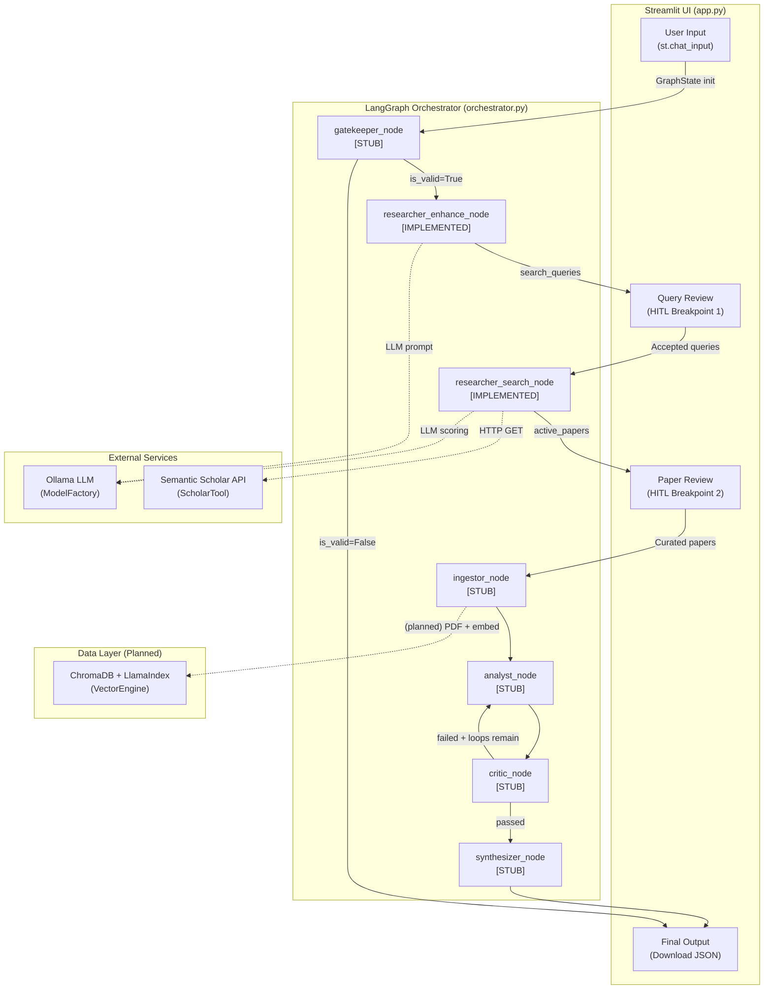
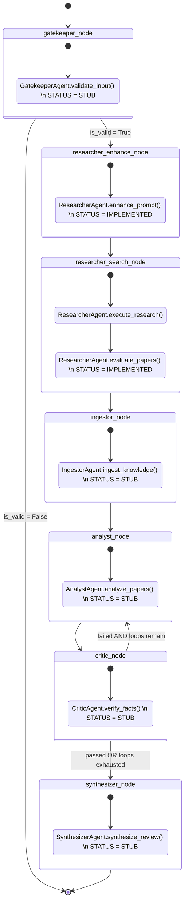
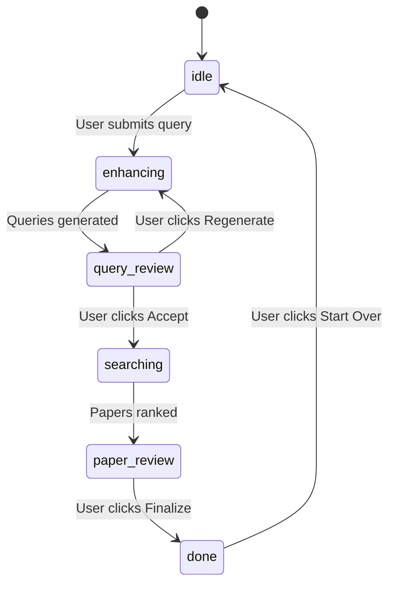
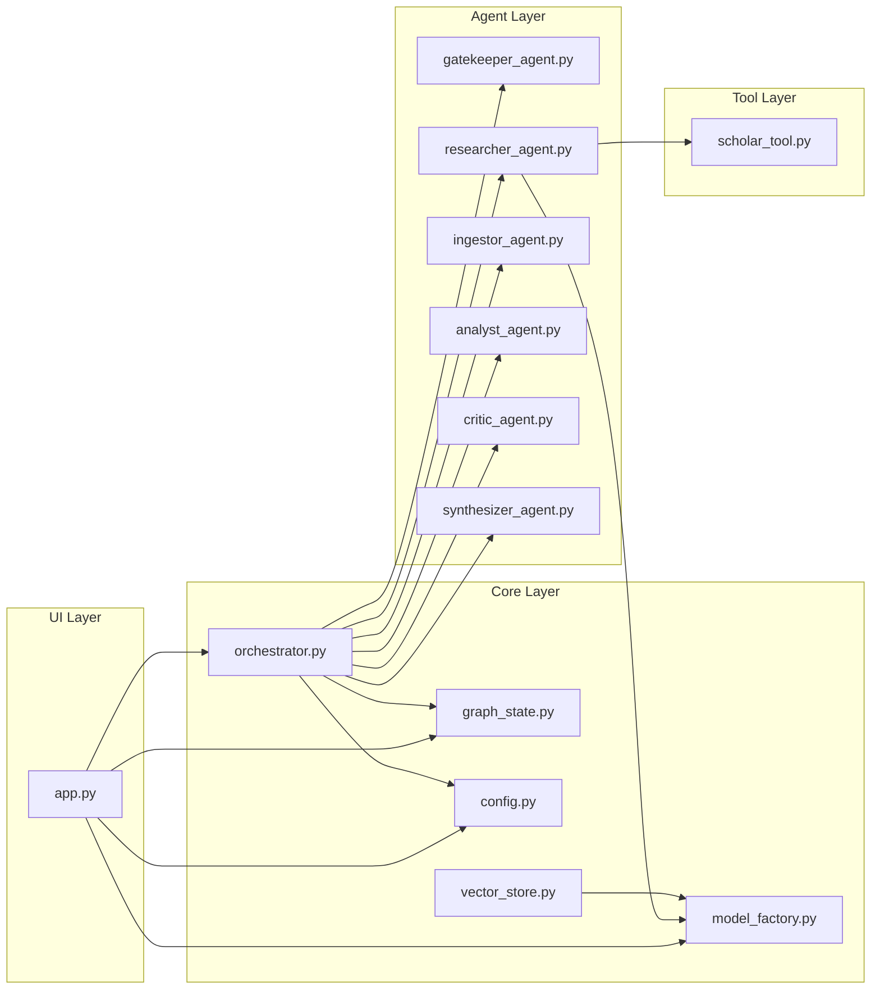

# SmartScholar — Internal Architecture Reference

> **Document Class:** Internal · Deep-Dive · Authoritative  
> **Last Updated:** 2026-05-27  
> **Scope:** Complete system architecture for the SmartScholar Agentic RAG pipeline.

> [!IMPORTANT]
> This document **strictly differentiates** between components that are **fully implemented** and those that are **structural stubs** returning mock data. Every stub section is annotated with a `[STATUS: STUB / TODO]` header. Do not assume any logic described under a stub heading exists in the codebase — it represents the *planned design intent* only.

---

## Table of Contents

1. [Executive Architecture Overview](#1-executive-architecture-overview)
2. [Core Infrastructure Components (Deep Dive)](#2-core-infrastructure-components-deep-dive)
3. [The Multi-Agent System (Function-by-Function Breakdown)](#3-the-multi-agent-system)
4. [The 16-Step Execution Flow](#4-the-16-step-execution-flow)
5. [UI & Observability (`app.py`)](#5-ui--observability-apppy)
6. [Appendix — Dependency Map](#6-appendix--dependency-map)

---

## 1. Executive Architecture Overview

### 1.1 Core Paradigm

SmartScholar implements an **Agentic RAG (Retrieval-Augmented Generation)** pipeline that automates scientific literature search, curation, analysis, and synthesis. The architecture is defined by three interlocking design principles:

| Principle | Implementation |
|---|---|
| **State-Machine Orchestration** | A [LangGraph](https://github.com/langchain-ai/langgraph) `StateGraph` defines the directed-acyclic execution topology. Every agent is a pure function `(GraphState, RunnableConfig) → dict` that receives the shared state, performs work, and returns a *partial update*. |
| **Reactive UI with HITL Breakpoints** | A [Streamlit](https://streamlit.io) application (`app.py`) drives a step-by-step workflow. Between major phases (query expansion → search → paper review → analysis), the pipeline **yields control to the user**, who can edit, accept, reject, or regenerate before the next graph segment fires. |
| **Unidirectional Data Flow** | Data flows in one direction: User Input → `GraphState` → Agent Nodes → `GraphState` → UI Render. The UI *never* writes directly to agent internals; it mutates `st.session_state.graph_state` and then invokes the next graph segment. |

### 1.2 Single Source of Truth (SSOT) — `config.yaml`

All numeric limits, depth settings, and loop budgets are centralised in a single YAML file at the project root. Three **research profiles** dictate system behaviour:

| Parameter | `fast` | `medium` | `pro` | Description |
|---|:---:|:---:|:---:|---|
| **`max_queries`** | 3 | 5 | 10 | Maximum number of expanded search queries the Researcher may generate. |
| **`top_n_papers`** | 3 | 5 | 10 | The cut-off point for the active vs. discarded paper split after scoring. |
| **`results_per_query`** | 3 | 5 | 10 | UI backward-compatibility alias (maps conceptually to `top_n_papers`). |
| **`active_paper_count`** | 3 | 5 | 10 | UI backward-compatibility alias displayed in the sidebar chip. |
| **`read_depth`** | `abstract` | `hybrid` | `full_pdf` | Depth of content ingestion (governs `IngestorAgent` behaviour). |
| **`chunk_size`** | 1024 | 512 | 256 | Character-level chunk size for text splitting during ingestion. |
| **`max_loops`** | 1 | 2 | 3 | Maximum Critic → Analyst feedback iterations before auto-approving. |

**Zero magic numbers rule:** Every node function resolves its limits at runtime via `_resolve_config(state)` → `get_config(profile)`. No hardcoded constants exist in any agent or orchestrator code.

### 1.3 High-Level Data-Flow Diagram



---

## 2. Core Infrastructure Components (Deep Dive)

### 2.1 `config.py` & `config.yaml`

**File:** [`config.py`](file:///c:/Users/olive/OneDrive/Desktop/Master%20Studium/KI/Praktikum/projekt/SmartScholar/src/core/config.py)  
**File:** [`config.yaml`](file:///c:/Users/olive/OneDrive/Desktop/Master%20Studium/KI/Praktikum/projekt/SmartScholar/config.yaml)

#### Mechanism

1. **Path Resolution:** `_PROJECT_ROOT` is computed by walking two levels up from `config.py`'s `__file__` path, yielding the SmartScholar project root. `_CONFIG_PATH` is then `os.path.join(_PROJECT_ROOT, "config.yaml")`.
2. **Load & Cache:** `_load_config()` reads and parses the YAML file exactly once via `@lru_cache(maxsize=1)`. Subsequent calls return the cached `dict` with zero disk I/O.
3. **Profile Access:** `get_config(profile_name: str)` performs a case-insensitive lookup into the `profiles` sub-dict. An unknown profile raises `ValueError` with a helpful message listing all valid profiles.
4. **Profile Enumeration:** `list_profiles()` returns `["fast", "medium", "pro"]` for UI rendering.

#### API Surface

| Function | Signature | Returns | Notes |
|---|---|---|---|
| `_load_config()` | `() → dict` | Full parsed YAML | Cached; raises `FileNotFoundError` if `config.yaml` is missing. |
| `get_config()` | `(profile_name: str) → dict` | Profile sub-dict | Case-insensitive key matching via `.strip().lower()`. |
| `list_profiles()` | `() → list[str]` | `["fast", "medium", "pro"]` | Used by UI but not currently called (sidebar hardcodes profile keys). |

---

### 2.2 `graph_state.py`

**File:** [`graph_state.py`](file:///c:/Users/olive/OneDrive/Desktop/Master%20Studium/KI/Praktikum/projekt/SmartScholar/src/core/graph_state.py)

`GraphState` is a `TypedDict(total=False)` — every key is optional, allowing nodes to return partial updates. LangGraph merges these updates into the accumulating state dict automatically.

#### Complete Key Reference

| Key | Type | Set By | Description |
|---|---|---|---|
| **`user_query`** | `str` | UI (initial state) | The raw research topic entered by the user. |
| **`config_profile`** | `str` | UI (initial state) | One of `"fast"`, `"medium"`, `"pro"`. Used by `_resolve_config()` in every node. |
| **`is_valid`** | `bool` | `gatekeeper_node` | `True` if the query passed validation. |
| **`validation_reason`** | `str` | `gatekeeper_node` | Human-readable rejection reason (empty string on accept). |
| **`search_queries`** | `list[str]` | `researcher_enhance_node` | Refined academic search terms produced by LLM query expansion. |
| **`query_strategy`** | `str` | `researcher_enhance_node` | Agent's internal monologue explaining why it chose specific search angles. |
| **`active_papers`** | `list[dict]` | `researcher_search_node` / `ingestor_node` | Papers selected for deep analysis (top-N by relevance score). |
| **`discarded_papers`** | `list[dict]` | `researcher_search_node` | Papers that scored below the active cut-off. Held in a reserve pool for HITL promotion. |
| **`paper_analysis_data`** | `list[dict]` | `analyst_node` | Structured analysis records (methodology, findings, limitations, relevance). |
| **`critic_feedback`** | `str` | `critic_node` | Textual feedback from the Critic agent. |
| **`loop_count`** | `int` | `critic_node` | Current Critic → Analyst iteration count. Starts at `0`, incremented by `critic_node` each pass. |
| **`final_review`** | `str` | `synthesizer_node` | The Markdown-formatted literature review produced by the Synthesizer. |

> [!NOTE]
> **Undeclared transient key:** `_critic_passed` (`bool`) is set by `critic_node` and consumed by `_route_after_critic()`. It is **not** declared in the `GraphState` TypedDict but exists in the runtime state dict. This is an intentional pattern to keep routing metadata out of the formal schema.

---

### 2.3 `orchestrator.py`

**File:** [`orchestrator.py`](file:///c:/Users/olive/OneDrive/Desktop/Master%20Studium/KI/Praktikum/projekt/SmartScholar/src/core/orchestrator.py)

This is the **nerve centre** of the system. It registers all agent node functions, defines the graph topology, provides conditional routing, and exposes streaming wrappers for the UI.

#### 2.3.1 Agent Singletons

Six module-level variables (`_gatekeeper`, `_researcher`, `_ingestor`, `_analyst`, `_critic`, `_synthesizer`) hold lazily-initialised agent instances. Each has a corresponding `_get_<agent>()` factory that performs thread-safe lazy init on first access. Agents are **never** re-created across invocations within the same process.

#### 2.3.2 Helper Functions

| Function | Purpose |
|---|---|
| `_resolve_config(state)` | Extracts `config_profile` from state (defaults to `"medium"`) and calls `get_config()`. |
| `_ui_log(config, msg)` | Pushes a `("ui_msg", msg)` tuple to the `Queue` stored in `config["configurable"]["ui_queue"]`. This is the **sole mechanism** by which nodes communicate real-time status to the Streamlit UI. |

#### 2.3.3 Node Functions

Every node function follows the same contract:

```
def node_name(state: GraphState, config: RunnableConfig) -> dict:
```

It reads from `state`, optionally calls `_resolve_config(state)` for profile limits, delegates to the agent singleton, emits UI logs via `_ui_log()`, and returns a **partial state update** dict.

| Node Function | Graph Steps | Agent | Status | Key Outputs |
|---|---|---|---|---|
| `gatekeeper_node` | 2, 9 | `GatekeeperAgent` | **STUB** | `is_valid`, `validation_reason` |
| `researcher_enhance_node` | 3 | `ResearcherAgent` | **Implemented** | `search_queries`, `query_strategy` |
| `researcher_search_node` | 5, 6, 7 | `ResearcherAgent` | **Implemented** | `active_papers`, `discarded_papers` |
| `ingestor_node` | 10A, 10B, 11B | `IngestorAgent` | **STUB** | `active_papers` (augmented with `ingested_content`) |
| `analyst_node` | 12, 13 | `AnalystAgent` | **STUB** | `paper_analysis_data` |
| `critic_node` | 14, 15 | `CriticAgent` | **STUB** | `critic_feedback`, `loop_count`, `_critic_passed` |
| `synthesizer_node` | 16 | `SynthesizerAgent` | **STUB** | `final_review` |

#### 2.3.4 Conditional Routing

| Router | Source Node | Condition | Target |
|---|---|---|---|
| `_route_after_gatekeeper` | `gatekeeper_node` | `is_valid == True` | `researcher_enhance_node` |
| | | `is_valid == False` | `END` |
| `_route_after_critic` | `critic_node` | `_critic_passed == True` | `synthesizer_node` |
| | | `_critic_passed == False` AND `loop_count < max_loops` | `analyst_node` (loop back) |
| | | `_critic_passed == False` AND `loop_count >= max_loops` | `synthesizer_node` (budget exhausted) |

#### 2.3.5 Graph Construction Functions

The orchestrator exposes **five** graph-building functions. The first four are **partial sub-graphs** designed for the HITL workflow; the fifth is the complete autonomous graph.

| Function | Topology | Purpose |
|---|---|---|
| `build_enhance_graph()` | `START → gatekeeper_node → (conditional) → researcher_enhance_node → END` | First HITL segment: validate + expand queries. |
| `build_regenerate_graph()` | `START → researcher_enhance_node → END` | Re-run query expansion only (skips gatekeeper on subsequent attempts). |
| `build_search_graph()` | `START → researcher_search_node → END` | Second HITL segment: execute multi-query search + scoring. |
| `build_analysis_graph()` | `START → analyst_node → END` | Third HITL segment: run the analysis stub. |
| `build_graph()` | Full 7-node topology with critic loop | **Autonomous mode** (not currently invoked by the UI). |

#### 2.3.6 Streaming Architecture (Thread + Queue)

The function `_run_graph_with_queue(graph, state)` is the **bridge** between LangGraph's synchronous `graph.invoke()` and Streamlit's coroutine-like rendering model:

1. A `queue.Queue()` is created.
2. A **daemon thread** runs `graph.invoke(state, config={"configurable": {"ui_queue": q}})`.
3. Inside each node, `_ui_log()` pushes `("ui_msg", msg)` tuples to the queue.
4. The main thread **yields** each message as it arrives (consumed by Streamlit's `st.write()` in the UI loop).
5. On completion, the worker pushes `("done", None)`. On error, it pushes `("error", exception)`.
6. The **final state dict** is yielded as the last value from the generator, allowing the UI to capture the updated `GraphState`.

Three convenience wrappers call `_run_graph_with_queue` with the appropriate sub-graph:

- **`stream_enhance_flow(state, regenerate=False)`** — uses `build_enhance_graph()` or `build_regenerate_graph()`.
- **`stream_search_flow(state)`** — uses `build_search_graph()`.
- **`stream_analysis_flow(state)`** — uses `build_analysis_graph()`.

#### 2.3.7 Full LangGraph Topology — Mermaid




## 3. The Multi-Agent System

### 3.1 `ResearcherAgent` — [STATUS: IMPLEMENTED]

**File:** [`researcher_agent.py`](file:///c:/Users/olive/OneDrive/Desktop/Master%20Studium/KI/Praktikum/projekt/SmartScholar/src/agents/researcher_agent.py)  
**Purpose:** Expands a user's natural-language topic into refined academic search queries, executes multi-query searches against Semantic Scholar, deduplicates results, and scores/ranks papers by relevance.

#### 3.1.1 Class Constants

| Constant | Description |
|---|---|
| **`QUERY_EXPANSION_PROMPT`** | A structured prompt template that instructs the LLM to return a JSON object with `"strategy"` (1-2 sentence monologue) and `"queries"` (array of exactly `{num_queries}` strings). Enforces **thematic constraint**: queries must remain "extremely close to the core theme of the user's original prompt" — no drift into tangential topics. |
| **`PAPER_SCORING_PROMPT`** | A structured prompt template for batch relevance scoring. Instructs the LLM to score each paper 0-100 across four criteria: topical relevance (50 pts), recency (15 pts), abstract quality (20 pts), citation impact (15 pts). Returns a JSON array of `{id, score, rationale}` objects. |

#### 3.1.2 Methods

##### `__init__(self)`

Initialises a single `Ollama` LLM instance via `ModelFactory.get_model()`. This instance is reused for all prompt completions.

##### `generate_search_queries(user_input: str, num_queries: int) → tuple[list[str], str]`

- **Workflow:**
  1. Formats `QUERY_EXPANSION_PROMPT` with `{user_input}` and `{num_queries}`.
  2. Calls `self.llm.complete(prompt)`.
  3. Attempts `_parse_json_object()` on the response to extract `{"strategy": ..., "queries": [...]}`.
  4. **Fallback path 1:** If the LLM returned a plain JSON array (legacy behaviour), tries `_parse_json_array()`.
  5. **Fallback path 2:** On any exception, returns `([], "Fallback: could not generate additional queries.")`.
- **Inputs:** `user_input` (raw topic), `num_queries` (cap from profile).
- **Outputs:** `(queries: list[str], strategy: str)`.

##### `enhance_prompt(user_query: str, config: dict) → tuple[list[str], str]`

- **Purpose:** Primary entry-point for `researcher_enhance_node`. Wraps `generate_search_queries` and applies the `max_queries` cap from the profile config.
- **Inputs:** `user_query`, `config` (must contain `max_queries`).
- **Outputs:** `(queries[:max_q], strategy)`.

##### `execute_research(user_input, queries, limit_per_query, status_callback) → list[dict]`

- **Workflow:**
  1. If `queries` is `None`, calls `generate_search_queries(user_input, 3)` as a fallback.
  2. If queries list is empty, falls back to `[user_input]` as the sole query.
  3. Iterates over each query, calling `ScholarTool.search_papers(q, limit=limit_per_query)`.
  4. Deduplicates by `paperId` using a `seen_ids: set[str]`.
  5. Emits status messages via `status_callback(msg)` at each iteration.
- **Inputs:** `user_input`, `queries` (pre-generated or `None`), `limit_per_query`, `status_callback`.
- **Outputs:** Deduplicated `list[dict]` of paper records.

##### `evaluate_papers(papers, user_query, config) → tuple[list[dict], list[dict]]`

- **Workflow:**
  1. **Primary path:** Calls `_llm_score()` for LLM-based batch evaluation.
  2. **Fallback path:** If LLM scoring raises an exception or returns `None`, falls back to `_heuristic_score()`.
  3. Splits scored list at `config["top_n_papers"]` into `(active, discarded)`.
  4. Each paper dict is augmented with `relevance_score` (int, 0-100) and `score_rationale` (str).
- **Inputs:** `papers`, `user_query`, `config` (must contain `top_n_papers`).
- **Outputs:** `(active_papers, discarded_papers)`, both sorted descending by score.

##### `_llm_score(papers, user_query) → list[dict] | None`

- Builds a compact JSON representation (id, title, abstract truncated to 300 chars, year, citationCount).
- Prompts the LLM with `PAPER_SCORING_PROMPT`.
- Parses the response via `_parse_json_array()`.
- Maps scores and rationales back onto the original paper dicts.
- Clamps scores to [0, 100].
- Returns `None` on any failure, triggering the heuristic fallback.

##### `_heuristic_score(papers, user_query) → list[dict]` (static)

Deterministic fallback scorer with three components (total = 100):
- **Keyword overlap** (0-50 pts): Jaccard-like token overlap between `user_query` and `title + abstract`.
- **Recency** (0-25 pts): `max(0, 25 - age * 3)` where `age = current_year - paper_year`.
- **Citation count** (0-25 pts): `min(25, int(log2(max(1, cites)) * 3))`.

Generates a synthetic `score_rationale` string from the component breakdown.

##### Parsing Helpers

| Method | Input | Output | Strategy |
|---|---|---|---|
| `_strip_markdown_fences(text)` | Raw LLM output | Cleaned text | Regex-strips `` ```json `` / `` ``` `` fences and trailing backticks. |
| `_parse_json_array(text)` | Cleaned text | `list \| None` | 1. Try `json.loads()` directly. 2. Regex-extract `[...]` substring and retry. |
| `_parse_json_object(text)` | Cleaned text | `dict \| None` | 1. Try `json.loads()` directly. 2. Regex-extract `{...}` substring and retry. |

---

### 3.2 `ScholarTool` — [STATUS: IMPLEMENTED]

**File:** [`scholar_tool.py`](file:///c:/Users/olive/OneDrive/Desktop/Master%20Studium/KI/Praktikum/projekt/SmartScholar/src/tools/scholar_tool.py)  
**Purpose:** HTTP client for the Semantic Scholar Academic Graph API.

#### Methods

##### `_get_api_key() → str | None` (static)

Reads the API key from `<project_root>/data/api_keys/semantic_scholar-api_key`. Returns `None` if the file does not exist (the API is still usable without a key, but at lower rate limits).

##### `search_papers(query: str, limit: int = 5) → list[dict]` (static)

- **Endpoint:** `https://api.semanticscholar.org/graph/v1/paper/search`
- **Query parameters:** `query`, `limit`, `fields=title,abstract,authors,year,openAccessPdf,url,citationCount`.
- **Headers:** `x-api-key` set if an API key file exists.
- **Response parsing:** Extracts author names from nested `{"name": ...}` objects. Extracts `openAccessPdf.url` from the nested object (or `None`).
- **Error handling:** Catches all exceptions and returns `[]` — ensures the pipeline never crashes from an API failure.

**Output schema per paper:**

| Key | Type | Source |
|---|---|---|
| `paperId` | `str` | API response |
| `title` | `str` | API response |
| `abstract` | `str \| None` | API response |
| `authors` | `list[str]` | Extracted from nested author objects |
| `year` | `int \| None` | API response |
| `citationCount` | `int` | API response (default `0`) |
| `openAccessPdf` | `str \| None` | Extracted URL from nested object |
| `url` | `str` | Semantic Scholar URL |

---

### 3.3 `ModelFactory` — [STATUS: IMPLEMENTED]

**File:** [`model_factory.py`](file:///c:/Users/olive/OneDrive/Desktop/Master%20Studium/KI/Praktikum/projekt/SmartScholar/src/core/model_factory.py)  
**Purpose:** Unified factory for Ollama LLM and embedding model instances.

#### Methods

| Method | Returns | Notes |
|---|---|---|
| `get_model()` | `Ollama` instance | `request_timeout=300.0`. Model name from `MODEL_NAME` env var (default `"llama3"`). |
| `get_model_name()` | `str` | Returns the configured model name string. |
| `get_embedding_model()` | `OllamaEmbedding` instance | Uses the same `MODEL_NAME` for embeddings. |
| `_load_env()` | `None` | Loads `.env` from CWD first, then falls back to the project root `.env`. |

---

### 3.4 `VectorEngine` — [STATUS: IMPLEMENTED but currently unused in pipeline]

**File:** [`vector_store.py`](file:///c:/Users/olive/OneDrive/Desktop/Master%20Studium/KI/Praktikum/projekt/SmartScholar/src/core/vector_store.py)  
**Purpose:** Manages ChromaDB-backed vector storage via LlamaIndex abstractions. Currently exists as infrastructure but is **not invoked** by any agent node or the UI — it was part of the pre-LangGraph architecture documented in `ARCHITECTURE_FLOW.md`.

#### Constructor

- Creates `./data/chroma_db` directory.
- Initialises a `chromadb.PersistentClient`.
- Creates/retrieves a collection named `"scholar_papers"`.
- Wraps the collection in a LlamaIndex `ChromaVectorStore`.
- Sets `Settings.llm` and `Settings.embed_model` globally to prevent OpenAI fallback.

#### Methods

| Method | Purpose | Current Status |
|---|---|---|
| `index_papers(papers)` | Converts paper dicts to `Document` objects (abstract as text, metadata for title/authors/year/url). Creates a `VectorStoreIndex`. Excludes `url` and `openAccessPdf` from LLM and embedding context. | **Exists but not called.** |
| `get_query_engine(index)` | Returns a LlamaIndex `QueryEngine` for RAG-based generation over the vector store. | **Exists but not called.** |

---

### 3.5 `GatekeeperAgent` — [STATUS: STUB / TODO]

**File:** [`gatekeeper_agent.py`](file:///c:/Users/olive/OneDrive/Desktop/Master%20Studium/KI/Praktikum/projekt/SmartScholar/src/agents/gatekeeper_agent.py)  
**Purpose:** Validates whether a user query is a legitimate, researchable academic topic. Invalid or malicious queries should be rejected before consuming LLM / API resources.

#### Current Implementation (Stub)

```python
def validate_input(self, query: str) -> tuple[bool, str]:
    # ---- STUB: accept everything ---- #
    return (True, "")
```

**The method unconditionally returns `(True, "")` for every input.** No LLM call, no classification, no filtering.

#### Planned Workflow (TODO)

1. **Input sanitisation:** Strip control characters, excessive whitespace, and prompt-injection patterns.
2. **LLM-based classification:** Prompt the LLM to classify the query as one of: `academic_topic`, `off_topic`, `harmful`, `too_vague`.
3. **Rejection with reason:** If classified as non-academic, return `(False, "reason")` with a human-readable explanation.
4. **Step 9 re-validation:** After the Critic loop, the Gatekeeper may be re-invoked to verify that the refined analysis still aligns with the original query intent.

---

### 3.6 `IngestorAgent` — [STATUS: STUB / TODO]

**File:** [`ingestor_agent.py`](file:///c:/Users/olive/OneDrive/Desktop/Master%20Studium/KI/Praktikum/projekt/SmartScholar/src/agents/ingestor_agent.py)  
**Purpose:** Processes accepted papers at the depth defined by the active profile's `read_depth`, then embeds and stores the resulting chunks in ChromaDB via `VectorEngine`.

#### Current Implementation (Stub)

The method reads `read_depth` and `chunk_size` from the config and writes a synthetic `ingested_content` string to each paper dict:

| `read_depth` | Stub Behaviour |
|---|---|
| `"abstract"` | `"[abstract-only] <first chunk_size chars of abstract>"` |
| `"hybrid"` | `"[hybrid] Abstract: <text> \| PDF first <chunk_size> chars: <stub>"` |
| `"full_pdf"` | `"[full_pdf] Full PDF processed in <chunk_size>-char chunks: <stub>"` |

**No actual PDF download, parsing, chunking, embedding, or ChromaDB insertion occurs.**

#### Planned Workflow (TODO)

1. **Abstract-only mode (`fast` profile):**
   - Extract the abstract text from the paper dict.
   - Chunk to `chunk_size` characters.
   - Convert to LlamaIndex `Document` objects.
   - Embed via `ModelFactory.get_embedding_model()` and insert into ChromaDB via `VectorEngine.index_papers()`.

2. **Hybrid mode (`medium` profile):**
   - Ingest the abstract as above.
   - If `openAccessPdf` URL is available, download the PDF.
   - Parse the PDF (planned: PyMuPDF or pdfplumber).
   - Extract the **first N chunks** (governed by `chunk_size`) from the PDF body.
   - Embed and store alongside the abstract chunks.

3. **Full-PDF mode (`pro` profile):**
   - Download the complete PDF via `openAccessPdf` URL.
   - Parse all pages into plaintext.
   - Chunk the entire document at `chunk_size`-character boundaries.
   - Embed all chunks and store in ChromaDB.
   - Planned: section-aware chunking (Introduction, Methods, Results, etc.).

4. **Augmented paper output:** Each paper dict would be augmented with `ingested_content` (the actual extracted text) and `chunk_ids` (references to ChromaDB document IDs) for downstream agents.

---

### 3.7 `AnalystAgent` — [STATUS: STUB / TODO]

**File:** [`analyst_agent.py`](file:///c:/Users/olive/OneDrive/Desktop/Master%20Studium/KI/Praktikum/projekt/SmartScholar/src/agents/analyst_agent.py)  
**Purpose:** Produces structured analysis records for each ingested paper, covering methodology, key findings, limitations, and relevance to the user's original query.

#### Current Implementation (Stub)

Returns a hardcoded template record for each paper:

```python
{
    "citation_id": "[1]",
    "methodology": "Methodology stub for '<title>'.",
    "findings": "Key findings stub for '<title>'.",
    "limitations": "Limitations not yet extracted (stub).",
    "user_relevance": "Relevance to '<query>' — assessed as HIGH (stub).",
}
```

**No LLM call, no RAG retrieval, no actual analysis is performed.**

#### Planned Workflow (TODO)

1. **Per-paper RAG query:** For each paper, query the ChromaDB vector store (via `VectorEngine.get_query_engine()`) to retrieve the most relevant chunks.
2. **Structured extraction prompt:** Prompt the LLM with retrieved context + a structured extraction template requiring:
   - `methodology` — research design, sample size, techniques used.
   - `findings` — primary quantitative and qualitative results.
   - `limitations` — acknowledged weaknesses, threats to validity.
   - `user_relevance` — explicit mapping between the paper's contributions and the user's query.
3. **Citation linkage:** Each record carries its `citation_id` (e.g., `[1]`, `[2]`) for downstream synthesis.
4. **Output:** `list[dict]` of structured analysis records stored in `paper_analysis_data`.

---

### 3.8 `CriticAgent` — [STATUS: STUB / TODO]

**File:** [`critic_agent.py`](file:///c:/Users/olive/OneDrive/Desktop/Master%20Studium/KI/Praktikum/projekt/SmartScholar/src/agents/critic_agent.py)  
**Purpose:** Quality gate that verifies the Analyst's output. Decides whether to approve (proceed to synthesis) or reject (loop back to Analyst for revision).

#### Current Implementation (Stub)

Deterministic toggle logic to exercise the loop mechanism:

| Condition | Returns |
|---|---|
| `loop_count >= max_loops` | `(True, "Loop budget exhausted. Auto-approving.")` |
| `loop_count == 0` | `(False, "First-pass review: requesting deeper analysis.")` |
| `loop_count > 0` | `(True, "Verification passed.")` |

**Effect:** The Critic always rejects on the first pass (forcing one loop back to the Analyst), then approves on the second pass. This exercises the LangGraph conditional routing without performing real verification.

#### Planned Workflow (TODO)

1. **Claim extraction:** Parse each analysis record's `findings` into individual factual claims.
2. **Source verification:** For each claim, query the vector store to find supporting evidence in the original paper text.
3. **Consistency check:** Verify that the Analyst's `methodology` and `limitations` descriptions are consistent with the source material.
4. **Scoring:** Assign a verification score to each claim. If the aggregate score falls below a threshold, return `(False, detailed_feedback)`.
5. **Targeted feedback:** The `feedback` string should specify which claims failed verification and why, so the Analyst can focus its revision.
6. **Loop control:** The `max_loops` parameter from the profile config governs how many revision cycles are permitted before auto-approval.

---

### 3.9 `SynthesizerAgent` — [STATUS: STUB / TODO]

**File:** [`synthesizer_agent.py`](file:///c:/Users/olive/OneDrive/Desktop/Master%20Studium/KI/Praktikum/projekt/SmartScholar/src/agents/synthesizer_agent.py)  
**Purpose:** Composes a formatted, citation-rich Markdown literature review from all approved analysis claims.

#### Current Implementation (Stub)

Generates a template Markdown document that mechanically lists each claim's fields:

```markdown
# Literature Review
## Overview
This review synthesises findings from **N sources**.
---
## Detailed Analysis
### Source [1]
**Methodology:** <stub text>
**Key Findings:** <stub text>
...
## Conclusion
> **Note:** This is a stub synthesis. Replace the `SynthesizerAgent` with
> LLM-powered generation for production-quality reviews.
```

**No LLM call. No narrative synthesis. No cross-paper comparison.**

#### Planned Workflow (TODO)

1. **Context assembly:** Concatenate all approved claims into a structured context block.
2. **LLM-powered synthesis:** Prompt the LLM with:
   - The original `user_query` as the framing question.
   - All approved analysis records as evidence.
   - Instructions to produce a cohesive narrative with:
     - Thematic organisation (not per-paper listing).
     - Cross-paper comparisons and contrasts.
     - Inline citations using the `citation_id` (e.g., "Recent work [1][3] demonstrates…").
     - A concluding section identifying gaps and future directions.
3. **Output:** A Markdown-formatted `final_review` string stored in state.

---

## 4. The 16-Step Execution Flow

The SmartScholar pipeline is conceptually divided into 16 steps. Steps 1–7 are **currently implemented**; steps 8–16 are **planned / stubbed**.

### Steps 1–7: Current Execution

| Step | Name | Implementing Component | Description |
|:---:|---|---|---|
| **1** | User Input | `app.py` (idle state) | User enters a research topic via `st.chat_input()`. The topic is stored in `st.session_state.current_query` and the workflow advances to `"enhancing"`. |
| **2** | Gatekeeper Validation | `gatekeeper_node` → `GatekeeperAgent.validate_input()` | **[STUB]** Currently auto-approves all queries. The gatekeeper runs as part of `build_enhance_graph()` and emits a UI log of acceptance. |
| **3** | Query Expansion | `researcher_enhance_node` → `ResearcherAgent.enhance_prompt()` | The LLM expands the user's topic into `max_queries` refined academic search terms. The agent's `query_strategy` monologue is captured. The UI transitions to `"query_review"`. |
| **4** | Human Review (HITL Breakpoint 1) | `app.py` (query_review state) | The user sees the generated queries displayed as editable text inputs with enable/disable checkboxes. The **foundational query** (user's original input) is always included and displayed separately. The user may: (a) edit individual queries, (b) uncheck queries to exclude them, (c) click "Regenerate" to re-run expansion with fresh LLM output, or (d) click "Accept & Search" to proceed. On accept, the foundational query is prepended to the accepted list. |
| **5** | Multi-Query Search | `researcher_search_node` → `ResearcherAgent.execute_research()` | Each accepted query is sent to `ScholarTool.search_papers()` against the Semantic Scholar API. Results are deduplicated by `paperId` using a `seen_ids` set. Status messages stream to the UI in real time. |
| **6** | Relevance Scoring | `researcher_search_node` → `ResearcherAgent.evaluate_papers()` | Papers are scored 0-100 via LLM batch evaluation (primary) or heuristic fallback (keyword overlap + recency + citations). Each paper receives `relevance_score` and `score_rationale`. |
| **7** | Active/Discarded Split | `researcher_search_node` (return) | Scored papers are sorted descending and split at `top_n_papers`. The top-N become `active_papers`; the remainder become `discarded_papers` (reserve pool). The UI transitions to `"paper_review"` (HITL Breakpoint 2). |

**HITL Breakpoint 2 (between Steps 7 and 8):** The user reviews ranked papers in expandable cards showing title, year, citation count, score badge (colour-coded: green ≥70, amber ≥40, red <40), agent rationale, abstract, and Semantic Scholar link. The user may uncheck papers, promote alternatives from the reserve pool, then click "Finalize Research" to proceed.

### Steps 8–16: Theoretical Flow [TODO: Pending Implementation]

> [!WARNING]
> **Steps 8–16 are not implemented.** The agent nodes exist as structural stubs that return mock data to keep the LangGraph running. The following describes the *planned* design intent based on the 16-step architecture.

| Step | Name | Planned Component | Planned Behaviour |
|:---:|---|---|---|
| **8** | Citation ID Assignment | `app.py` (paper_review → done) | **Currently implemented in the UI** — `app.py` assigns sequential `citation_id` values (`[1]`, `[2]`, …) to the final active papers before invoking the analysis flow. |
| **9** | Re-Validation | `gatekeeper_node` (second pass) | **[TODO]** Planned: re-invoke the Gatekeeper to verify the curated paper set still aligns with the original query intent. Not currently triggered. |
| **10A** | Abstract Ingestion | `ingestor_node` → `IngestorAgent` | **[TODO]** For `read_depth="abstract"`: extract abstract text, chunk at `chunk_size`, embed via Ollama, store in ChromaDB. Currently returns a stub string. |
| **10B** | Hybrid Ingestion | `ingestor_node` → `IngestorAgent` | **[TODO]** For `read_depth="hybrid"`: ingest abstract + download PDF via `openAccessPdf` URL + extract first N chunks. Currently returns a stub string. |
| **11B** | Full-PDF Ingestion | `ingestor_node` → `IngestorAgent` | **[TODO]** For `read_depth="full_pdf"`: download complete PDF, parse all pages, chunk entire document at `chunk_size` boundaries, embed all chunks. Currently returns a stub string. |
| **12** | Per-Paper Analysis | `analyst_node` → `AnalystAgent` | **[TODO]** RAG-query ChromaDB for each paper's chunks, prompt LLM for structured extraction (methodology, findings, limitations, relevance). Currently returns hardcoded template records. |
| **13** | Cross-Paper Synthesis Prep | `analyst_node` → `AnalystAgent` | **[TODO]** Planned: identify thematic clusters across papers, detect agreements/contradictions, prepare comparative analysis. Currently not implemented. |
| **14** | Fact Verification | `critic_node` → `CriticAgent` | **[TODO]** Verify each claim against source text in the vector store. Currently uses deterministic toggle logic (reject first pass, approve second). |
| **15** | Critic → Analyst Loop | `_route_after_critic` | **Routing logic is implemented.** The conditional edge and loop-budget check work correctly. However, since both the Critic and Analyst are stubs, the loop produces no meaningful refinement. |
| **16** | Final Synthesis | `synthesizer_node` → `SynthesizerAgent` | **[TODO]** LLM-powered narrative synthesis with thematic organisation, cross-paper comparison, inline citations, and gap analysis. Currently produces a mechanical template listing. |

---

## 5. UI & Observability (`app.py`)

**File:** [`app.py`](file:///c:/Users/olive/OneDrive/Desktop/Master%20Studium/KI/Praktikum/projekt/SmartScholar/app.py)

### 5.1 Separation of Concerns (SoC)

The UI layer adheres to a strict SoC principle:

| Responsibility | Owner | Boundary |
|---|---|---|
| **State management** | `st.session_state` | All workflow state, graph state, trace logs, and widget keys live here. |
| **Orchestration** | `orchestrator.py` | All agent logic, graph construction, and conditional routing. The UI never instantiates agents or calls agent methods directly. |
| **Data flow** | `GraphState` dict | The UI reads from and writes to a plain `dict` mirroring `GraphState`. It passes this dict into `stream_*_flow()` functions and receives the updated dict back. |
| **Rendering** | Streamlit components | `st.chat_message`, `st.status`, `st.expander`, `st.checkbox`, `st.text_input`, `st.button`, `st.download_button`. |

**The UI never:**
- Imports or instantiates agent classes directly.
- Calls LLM or API functions.
- Accesses `config.yaml` except through `get_config()` for sidebar display.

### 5.2 Workflow State Machine

The UI implements a finite state machine via `st.session_state.workflow_step`:



| State | UI Behaviour | Sidebar |
|---|---|---|
| `idle` | `st.chat_input` is active. Profile selector is enabled. | Profile radio enabled. |
| `enhancing` | `st.status` container streams LangGraph trace messages in real time. User's query shown in chat bubble. | Profile radio disabled. "Start Over" button visible. |
| `query_review` | Editable query cards with checkboxes. Regenerate / Accept buttons. Strategy monologue shown in `st.info`. | Profile radio disabled. |
| `searching` | `st.status` container streams search progress and scoring. | Profile radio disabled. |
| `paper_review` | Expandable paper cards with score badges, rationales, abstracts. Promote-from-reserve and Finalize buttons. | Profile radio disabled. |
| `done` | Final paper table with citation IDs. Analyst stub output in expander. Download JSON button. | Profile radio disabled. |

### 5.3 Session State Variables

| Key | Type | Default | Purpose |
|---|---|---|---|
| `workflow_step` | `str` | `"idle"` | Current FSM state. |
| `current_query` | `str \| None` | `None` | The user's raw research topic. |
| `config_profile` | `str` | `"medium"` | Active profile name. |
| `graph_state` | `dict \| None` | `None` | Mirrors the LangGraph `GraphState`. |
| `search_queries_edit` | `list \| None` | `None` | Mutable copy of generated queries for the review UI. |
| `trace_steps` | `list[str]` | `[]` | Accumulated trace messages for replay in collapsed status containers. |
| `query_gen` | `int` | `0` | Generation counter incremented on each "Regenerate" click. Used to generate unique Streamlit widget keys (`q_enable_{gen}_{i}`, `q_text_{gen}_{i}`), preventing stale widget state. |

### 5.4 The "Trace of Thought" UI Block

The Trace of Thought is a unified observability pattern implemented via `st.status()` containers. It works as follows:

1. **During execution:** An `st.status("label", expanded=True)` container is opened. Inside the `with` block, a `_log(msg)` closure calls `st.write(msg)` (immediate render) and appends `msg` to a `trace` list.
2. **The streaming loop:** `for event in stream_*_flow(state):` iterates over the generator. String events are rendered via `_log()`. The final `dict` event is the updated `GraphState`.
3. **After execution:** The status container is updated to `state="complete", expanded=False`.
4. **On subsequent re-renders:** The trace is replayed from `st.session_state.trace_steps` inside a collapsed `st.status` container, preserving the audit trail without re-executing the graph.

This pattern provides:
- **Real-time streaming** of agent progress (which query is being searched, how many papers found, scoring status).
- **Persistent audit trail** across Streamlit re-renders.
- **Collapsible display** to avoid overwhelming the user with technical detail.

### 5.5 Custom Styling

The UI injects a `<style>` block with custom CSS for:
- **Typography:** Google Fonts `Inter` (weights 300-600).
- **Brand gradient:** `linear-gradient(75deg, #1a73e8, #8ab4f8)` on the title.
- **Score badges:** Colour-coded spans (`.score-high` green, `.score-mid` amber, `.score-low` red).
- **Profile chip:** Gradient pill (`#e8eaf6 → #c5cae9`) displaying profile limits.
- **Step indicator:** Centred text showing the current workflow step with the active step highlighted in brand blue.
- **Component polish:** Rounded corners, subtle box-shadows, and consistent padding on `stChatMessage`, `stStatusContainer`, and `stExpander`.

---

## 6. Appendix — Dependency Map

### 6.1 Python Dependencies

| Package | Version | Purpose |
|---|---|---|
| `streamlit` | latest | UI framework |
| `llama-index` | latest | RAG framework (Document, VectorStoreIndex, Settings) |
| `llama-index-llms-ollama` | latest | Ollama LLM integration |
| `llama-index-embeddings-ollama` | latest | Ollama embedding integration |
| `llama-index-vector-stores-chroma` | latest | ChromaDB ↔ LlamaIndex bridge |
| `chromadb` | latest | Persistent vector database |
| `langgraph` | latest | State-machine graph orchestration |
| `langchain-core` | latest | `RunnableConfig` type used by LangGraph nodes |
| `python-dotenv` | latest | `.env` file loading |
| `pydantic` | latest | Data validation (transitive dependency) |
| `requests` | latest | HTTP client for Semantic Scholar API |
| `PyYAML` | latest | YAML config parsing |

### 6.2 File Tree

```
SmartScholar/
├── .env                          # MODEL_NAME=llama3
├── config.yaml                   # SSOT profiles (fast/medium/pro)
├── requirements.txt
├── app.py                        # Streamlit UI + HITL workflow
├── ARCHITECTURE.md               # ← This document
├── ARCHITECTURE_FLOW.md          # Legacy pre-LangGraph architecture doc
├── README.md
├── data/
│   ├── api_keys/
│   │   └── semantic_scholar-api_key
│   └── chroma_db/                # ChromaDB persistent storage (generated)
└── src/
    ├── __init__.py
    ├── agents/
    │   ├── __init__.py
    │   ├── researcher_agent.py   # [IMPLEMENTED] Query expansion + search + scoring
    │   ├── gatekeeper_agent.py   # [STUB] Auto-approves all queries
    │   ├── ingestor_agent.py     # [STUB] Mock ingestion strings
    │   ├── analyst_agent.py      # [STUB] Template analysis records
    │   ├── critic_agent.py       # [STUB] Deterministic toggle logic
    │   └── synthesizer_agent.py  # [STUB] Template Markdown output
    ├── core/
    │   ├── __init__.py
    │   ├── config.py             # [IMPLEMENTED] YAML loader + profile accessor
    │   ├── graph_state.py        # [IMPLEMENTED] GraphState TypedDict
    │   ├── orchestrator.py       # [IMPLEMENTED] LangGraph topology + streaming
    │   ├── model_factory.py      # [IMPLEMENTED] Ollama LLM/embedding factory
    │   └── vector_store.py       # [IMPLEMENTED] ChromaDB + LlamaIndex (unused)
    ├── tools/
    │   └── scholar_tool.py       # [IMPLEMENTED] Semantic Scholar API client
    └── utils/
        └── __init__.py
```

### 6.3 Import Dependency Graph



---

## 7. Current Limitations & Future Work

While the system successfully implements an end-to-end agentic workflow, a few core limitations exist in its current iteration:

* **Concise Literature Reviews:** The generated literature review currently tends to be relatively short. When using smaller or weaker local language models, they often struggle to maintain context and produce long-form, comprehensive narratives. To mitigate this without relying on massive commercial models, a future architecture should incorporate a *Multi-Agent Synthesizer* to break the drafting process down into iterative, section-by-section tasks.
* **Full-Text Availability Gaps:** The system is constrained by external source data. It is not currently possible to fetch the full text of every single paper within the Semantic Scholar or arXiv databases due to paywalls, licensing restrictions, or incomplete API extraction. Consequently, the pipeline must frequently fall back on analyzing abstracts or limited open-access subsets rather than the full body of work. It might be possible in future expansions, to give the API all available accesses of paid services or alternatively to give the user the option to upload files themselves.
---

> **End of Document**
