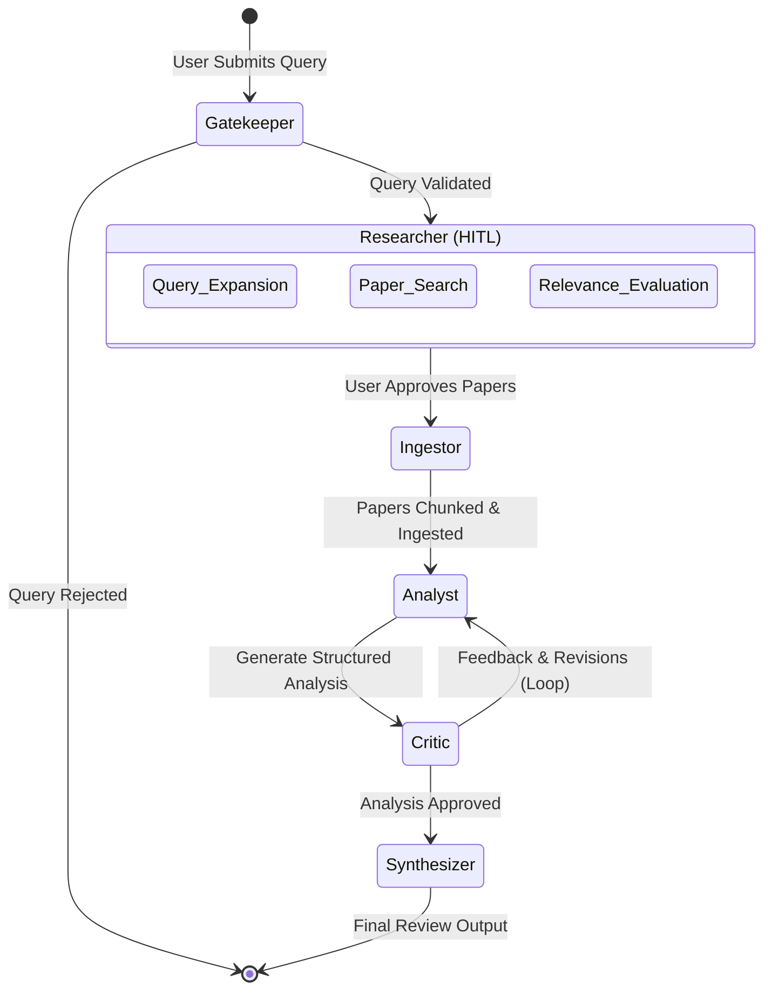

# SmartScholar - Agentic Research Copilot

## Team Members
* Oliver Tano Schlichting
* Simon Thomae
* Tobias Haugg
* Shoaib Amiri
* Ahmed Radwan

## What we want to build
We aim to build a Retrieval-Augmented Generation (RAG)-based research assistant that autonomously collects and analyzes scientific papers using the Semantic Scholar API. This agentic tool will generate structured, comprehensive literature reviews to support academic research. The project focuses predominantly on RAG methodologies, effective LLM tool use, and the rigorous evaluation of response faithfulness.

## Architecture & Tech Stack

**Tech Stack:**
- **UI Framework:** Streamlit
- **Agent Orchestration:** LangGraph
- **Language Models:** Ollama (Llama 3)
- **Vector Database:** ChromaDB
- **Configuration Management:** PyYAML
- **Academic Data Provider:** Semantic Scholar API

**Workflow Architecture:**
The system is constructed as a Skeleton-Driven, LangGraph-orchestrated state machine.



## Key Engineering Features

- **Human-in-the-Loop (HITL):** SmartScholar strategically pauses at critical junctures. The UI allows the user to manually curate the LLM-generated search queries and explicitly select which papers should proceed to the deep, token-intensive ingestion process, effectively acting as an interactive governor on the autonomous pipeline.
- **Real-Time Observability:** Leveraging a threaded, queue-backed streaming architecture within LangGraph, the application exposes a unified "Trace of Thought" UI. This streams system logs and internal agent reasoning chronologically and in real-time, preventing UI freezes and providing complete transparency into the agentic decision-making process.
- **SSOT Configuration:** The entire application enforces a strict Single Source of Truth via `config.yaml`. The configuration scales across dynamically selectable research profiles (`Fast ⚡`, `Medium ⚖️`, `Pro 🔬`), ensuring that limits, thresholds, and chunk sizes can be universally applied to the agents, orchestrator, and UI without modifying the underlying Python codebase.

## Directory Structure

```text
SmartScholar/
├── config.yaml             # Single Source of Truth configuration file
├── app.py                  # Streamlit UI Controller & View
├── requirements.txt        # Python dependencies
└── src/
    ├── core/               # Orchestration, graph state, configuration loaders, and model factories
    │   ├── config.py
    │   ├── graph_state.py
    │   ├── model_factory.py
    │   └── orchestrator.py
    ├── agents/             # Autonomous agent implementations
    │   ├── gatekeeper_agent.py
    │   ├── researcher_agent.py
    │   ├── ingestor_agent.py
    │   ├── analyst_agent.py
    │   ├── critic_agent.py
    │   └── synthesizer_agent.py
    └── tools/              # External API connectors and utilities
        └── scholar_tool.py
```

## Getting Started

Follow these steps to initialize and run the SmartScholar copilot locally:

1. **Clone the Repository:**
   ```bash
   git clone <repository-url>
   cd SmartScholar
   ```

2. **Set Up a Virtual Environment:**
   ```bash
   python -m venv .venv
   ```
   *Activate the environment:*
   - Windows: `.venv\Scripts\activate`
   - macOS/Linux: `source .venv/bin/activate`

3. **Install Dependencies:**
   ```bash
   pip install -r requirements.txt
   ```

4. **Configuration Setup:**
   Ensure `config.yaml` is present at the root directory. This dictates the active limits for the search profiles.

5. **Start the Application:**
   Launch the Streamlit interface:
   ```bash
   streamlit run app.py
   ```
